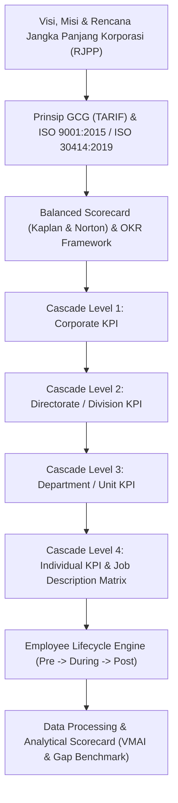
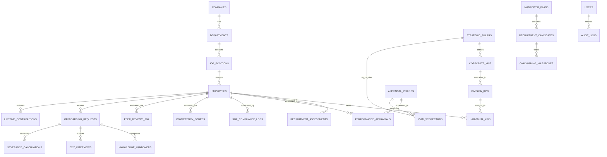
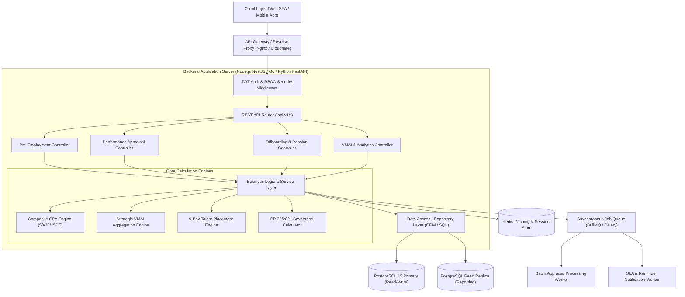
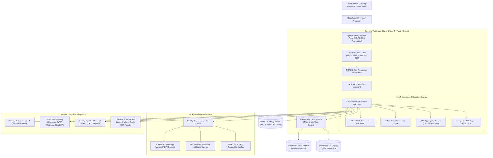

# PRODUCT REQUIREMENTS DOCUMENT (PRD)
# Sistem Manajemen Kinerja Karyawan Terintegrasi Berbasis GCG & Employee Lifecycle
**Nama Proyek:** Enterprise Employee Performance & Lifecycle Analytics (E-PerformIQ)  
**Versi:** 1.0.0  
**Tanggal:** 20 September 2026  
**Klasifikasi:** Confidential / Internal Enterprise Standard  

---

## 1. Executive Summary & Visi Produk

### 1.1 Latar Belakang
Pengelolaan kinerja karyawan di perusahaan terkemuka (*Tier-1 Enterprise / BUMN Unggul / Fortune 500*) menuntut integrasi yang kohesif antara **Visi & Misi Perusahaan**, **Tata Kelola Perusahaan yang Baik (Good Corporate Governance - GCG)**, dan **Siklus Hidup Karyawan (Employee Lifecycle - ELC)**. 

Banyak organisasi menghadapi fenomena *silo assessment*, di mana evaluasi rekrutmen tidak terhubung dengan kinerja harian, dan data kontribusi karyawan hilang saat karyawan mengundurkan diri (resign/pensiun). Akibatnya, manajemen puncak tidak memiliki visibilitas data holistik mengenai apakah investasi sumber daya manusia (SDM) benar-benar menggerakkan pencapaian target strategis korporasi.

### 1.2 Tujuan Produk
Aplikasi **E-PerformIQ** dirancang untuk:
1. **Mengotomatisasi & Mengintegrasikan Pengukuran Kinerja** mulai dari tahap *Pre-employment* (Perencanaan, Rekrutmen, Orientasi), *During Employment* (Jobdesk, KPI/GPA, SOP, Kompetensi), hingga *Post-employment* (Handover, Exit Clearance, Hak Pensiun/Pesangon, dan Lifetime Contribution Index).
2. **Menjamin Tata Kelola yang Baik (GCG)** melalui prinsip **TARIF** (*Transparency, Accountability, Responsibility, Independency, Fairness*).
3. **Menyediakan Mesin Analitik Strategis (*Strategic Alignment Engine*)** yang mengagregasi ribuan poin data individual untuk mengukur deviasi terhadap Standar Industri Terkemuka (*Industry Benchmarks*) serta menghitung **Vision & Mission Alignment Index (VMAI)**.

---

## 2. Landasan Metodologi & Standar Resmi Industri

Aplikasi ini dibangun mengacu pada standar tata kelola dan pengukuran SDM internasional yang diakui:



1. **Balanced Scorecard (BSC) - Kaplan & Norton:** 4 Perspektif Kinerja (Finansial, Pelanggan, Proses Bisnis Internal, Pembelajaran & Pertumbuhan).
2. **Kriteria Penilaian Kinerja Unggul (KPKU / Malcolm Baldrige):** Standardisasi pengukuran efektivitas kepemimpinan dan manajemen tenaga kerja.
3. **ISO 30414:2019 (Human Resource Management - Guidelines for Human Capital Reporting):** Standar internasional metrik tenaga kerja (produktivitas, turnover biaya, suksesi, kepatuhan).
4. **9-Box Talent Matrix (McKinsey / GE):** Segmentasi karyawan berdasarkan Kinerja (*Performance*) vs Potensi (*Potential*).
5. **Regulasi Ketenagakerjaan Nasional:** UU Ketenagakerjaan No. 13/2003, UU Cipta Kerja No. 6/2023, PP No. 35/2021 (PKWT, Alih Daya, Waktu Kerja, dan Pemutusan Hubungan Kerja), serta regulasi DPLK/BPJS Ketenagakerjaan.

---

## 3. Matriks Indeks KPI End-to-End Employee Lifecycle

Sistem membagi penilaian ke dalam 3 fase utama dengan metrik formal berbobot:

```
+----------------------------------------------------------------------------------------------------+
|                                    EMPLOYEE LIFECYCLE EVALUATION                                   |
+---------------------------------+----------------------------------+-------------------------------+
|       1. PRE-EMPLOYMENT         |       2. DURING EMPLOYMENT       |       3. POST-EMPLOYMENT      |
|  - MPP Fulfillment Rate         |  - Cascaded KPI (BSC / OKR)      |  - Knowledge Handover Index   |
|  - Quality of Hire (QoH)        |  - GPA (Performance Score)       |  - Regrettable Attrition Rate |
|  - Recruitment SLA & Cost       |  - SOP & Compliance Adherence    |  - Exit Sentiment Analysis    |
|  - 30-60-90 Day Onboarding Fit  |  - Core & Competency Index       |  - Severance & Pension SLA    |
|  - Probation Conversion Rate    |  - 360 Feedback & Core Values    |  - Lifetime Contribution Index|
+---------------------------------+----------------------------------+-------------------------------+
```

### 3.1 Fase 1: Pra-Bekerja (Pre-Employment)

Tujuan: Memastikan tenaga kerja yang masuk sesuai perencanaan strategis, kompeten, dan cepat beradaptasi.

| Kode Indeks | Nama Indeks KPI | Rumus / Metodologi Pengukuran | Target Benchmark Industri | Bobot Standar |
| :--- | :--- | :--- | :--- | :--- |
| **PRE-01** | **MPP Alignment Ratio** (Kesesuaian Formasi SDM) | $\frac{\text{Jumlah Kebutuhan Terpenuhi}}{\text{Kebutuhan Disetujui dalam Manpower Plan}} \times 100\%$ | $95\% - 100\%$ | 20% |
| **PRE-02** | **Quality of Hire (QoH)** | Rata-rata Skor: (Hasil Tes Teknis + Skor Psikometri + Skor Wawancara Kompetensi + Skor Evaluasi Probation) | $\ge 85 / 100$ | 25% |
| **PRE-03** | **Time-to-Fill SLA** | Waktu sejak Permintaan Tenaga Kerja (FPTK) disetujui hingga kandidat menandatangani Offering Letter | Manajerial: $\le 45$ hari<br>Staf: $\le 25$ hari | 15% |
| **PRE-04** | **Cost per Hire Efficiency** | $\frac{\text{Total Biaya Rekrutmen (Iklan + Vendor + Asesmen)}}{\text{Total Karyawan Diterima}}$ vs Anggaran Rekrutmen | Varians $\le \pm 5\%$ dari budget | 10% |
| **PRE-05** | **Onboarding Assimilation Index (30-60-90 Days)** | Evaluasi berkala: pemahaman jobdesk (30 hari), penguasaan sistem/alat (60 hari), kontribusi proyek independen (90 hari) | Skor $\ge 80\%$ pada hari ke-90 | 15% |
| **PRE-06** | **Probation Success Rate** | $\frac{\text{Karyawan Lolos Percobaan Tanpa Perpanjangan}}{\text{Total Karyawan Probation}} \times 100\%$ | $\ge 90\%$ | 15% |

---

### 3.2 Fase 2: Saat Bekerja (During Employment)

Tujuan: Mengukur eksekusi harian, kontribusi output target, kepatuhan proses (SOP), dan pengembangan kapabilitas.

Sistem menghitung **Composite Grade Point Average (GPA) Karyawan** dengan formula:

$$\text{Total Performance Score (GPA)} = (W_{\text{kpi}} \times S_{\text{kpi}}) + (W_{\text{sop}} \times S_{\text{sop}}) + (W_{\text{comp}} \times S_{\text{comp}}) + (W_{\text{val}} \times S_{\text{val}})$$

*Keterangan: $W$ = Bobot (Weight), $S$ = Skor (Score).*

| Kode Indeks | Komponen Penilaian | Parameter Pengukuran | Target Benchmark | Bobot Standar |
| :--- | :--- | :--- | :--- | :--- |
| **DUR-01** | **Cascaded Individual KPI** | Realisasi output kerja spesifik per peran berdasarkan 4 pilar Balanced Scorecard (Finansial, Pelanggan, Internal, Inovasi) | $\ge 100\%$ pencapaian target SMART | **50%** |
| **DUR-02** | **SOP & SLA Compliance Index** | - Tingkat kesalahan prosedur (*error rate*) <br>- Audit temuan non-compliance (ISO internal/audit eksternal) <br>- Ketepatan waktu SLA tugas operasional | 0 Fatal Error, <br>SLA $\ge 98\%$ | **20%** |
| **DUR-03** | **Competency Mastery (Hard & Soft Skills)** | Asesmen kesenjangan kompetensi (*Skill Gap Analysis*) berdasar standar kamus kompetensi jabatan (Level 1-5) | Skill Gap Index $\le 0.15$ | **15%** |
| **DUR-04** | **Core Values & 360° Feedback** | Evaluasi perilaku kerja berdasarkan Nilai Luhur Budaya Perusahaan (contoh: AKHLAK / Integritas / Kolaborasi) dinilai oleh Atasan, Rekan, dan Bawahan | Skor Peer Review $\ge 4.2 / 5.0$ | **15%** |

#### Sub-Matriks Pengukuran Tambahan (Operasional):
* **Kehadiran & Disiplin (Attendance Adherence):** Toleransi keterlambatan $< 0.5\%$, Indeks Bradford $< 45$.
* **Training Hours & Effectiveness (Kirkpatrick Level 2 & 3):** Minimal 24 Jam Pelatihan/tahun/karyawan dengan Pre-Test vs Post-Test Delta $\ge +25\%$.
* **Continuous Improvement / Ide Inovasi:** Minimal 1 usulan Kaizen / ide perbaikan proses per semester.

---

### 3.3 Fase 3: Pasca Bekerja (Post-Employment)

Tujuan: Mengamankan kelangsungan bisnis (*business continuity*), mitigasi risiko kebocoran data, pemenuhan hak legal, dan audit reputasi perusahaan.

| Kode Indeks | Nama Indeks KPI | Parameter & Metode Pengukuran | Target Benchmark | Bobot Standar |
| :--- | :--- | :--- | :--- | :--- |
| **PST-01** | **Knowledge Handover & Asset Clearance** | Persentase serah terima dokumen, proyek berjalan, akses kredensial, dan aset fisik sebelum *Last Working Day* (LWD) | $100\%$ tuntas sebelum LWD | 25% |
| **PST-02** | **Regrettable Attrition Rate** | Rasio turnover karyawan berkinerja tinggi (*Talent High-Potential* / Top 20% 9-Box) | $\le 3\%$ per tahun | 20% |
| **PST-03** | **Exit Interview Sentiment & Root Cause Index** | Analisis tematik alasan keluar (Kompensasi, Kepemimpinan, Lingkungan Kerja, Jalur Karir) untuk perbaikan GCG | Audit kepuasan exit $\ge 75\%$ | 15% |
| **PST-04** | **Severance & Pension Handover SLA** | Ketepatan waktu penghitungan dan transfer hak pesangon/DPLK/JHT BPJS Ketenagakerjaan sesuai PP 35/2021 | 100% dibayarkan $\le 7$ hari kerja dari LWD | 20% |
| **PST-05** | **Lifetime Contribution Index (LCI)** | Nilai akumulatif pencapaian masa bakti: <br>$\text{LCI} = \sum (\text{Skor KPI Tahunan} \times \text{Bobot Peran}) + \text{Inovasi/Paten}$ | Terarsip dalam Talent Legacy Hall of Fame | 20% |

---

## 4. Analisis Konsep: Strategic Alignment Engine (VMAI)

Bagaimana membuktikan apakah seluruh hasil KPI tersebut selaras dengan **Visi dan Misi Perusahaan** serta standar resmi korporasi terkemuka?

```mermaid
flowchart LR
    subgraph InputData["Input Data Multidimensi"]
        D1["Data Pre-Employment (QoH, SLA)"]
        D2["Data During-Employment (KPI, SOP, Core Values)"]
        D3["Data Post-Employment (Clearance, Retention)"]
    end

    subgraph Processing["Strategic Alignment Engine"]
        P1["Normalisasi Data (Z-Score & Min-Max)"]
        P2["Bobot Strategis Berdasarkan Visi-Misi Matrix"]
        P3["Benchmark Gap Analysis (Perbandingan Standar Industri)"]
    end

    subgraph Output["Output Analisis Eksekutif"]
        O1["Vision & Mission Alignment Index (VMAI)"]
        O2["Strategic Pillar Heatmap"]
        O3["Rekomendasi Kebijakan GCG Otomatis"]
    end

    InputData --> Processing --> Output
```



### 4.1 Vision & Mission Alignment Index (VMAI) Formula

Setiap Visi dan Misi dijabarkan menjadi **Pilar Strategis Korporasi ($P_j$)**. Setiap KPI karyawan diwajibkan memiliki *tagging* kontribusi terhadap salah satu pilar strategis:

$$VMAI = \sum_{j=1}^{M} W_{P_j} \times \left( \frac{\sum_{i=1}^{N_j} (\text{Achieved KPI}_{i} \times W_{i})}{\sum_{i=1}^{N_j} (\text{Target KPI}_{i} \times W_{i})} \times \text{GCG Compliance Factor}_{j} \right)$$

*Di mana:*
* $W_{P_j}$ = Bobot prioritas pilar strategis dari Dewan Direksi / RUPST (Total = 1.0).
* $\text{GCG Compliance Factor}_j$ = Faktor pengali kepatuhan $(0.0 - 1.0)$ berdasarkan audit kepatuhan SOP & etika bisnis. Jika ada pelanggaran fatal GCG, nilai pilar dapat dikurangi secara proporsional.

### 4.2 Kategori Status Keselarasan Strategis (VMAI Thresholds)
* **$\ge 95\%$ (Exceptional Strategic Alignment):** Kinerja SDM melampaui standar industri terkemuka; akselerasi tercapainya visi perusahaan berada di jalur cepat.
* **$85\% - 94.9\%$ (Healthy & Aligned):** Berada pada koridor standar perusahaan terkemuka (*Industry Best Practice*). Tata kelola berjalan tertib.
* **$70\% - 84.9\%$ (Sub-Standard / Gap Identified):** Terjadi deviasi pada salah satu fase lifecycle (misal: turnover tinggi atau kepatuhan SOP rendah). Memerlukan koreksi manajemen.
* **$< 70\%$ (Critical Misalignment):** Aktivitas karyawan tidak berkontribusi pada pencapaian visi dan misi, atau terjadi pelanggaran berat pada pilar GCG.

---

## 5. Fitur Utama & Spesifikasi Fungsional Produk

### 5.1 Modul 1: Pre-Employment Talent Gateway
* **Manpower Planning Tracker:** Dashboard kuota formasi tahunan vs realisasi rekrutmen. Notifikasi otomatis jika departemen mengajukan formasi di luar anggaran.
* **Smart Assessment Scoring:** Input skor psikotes, studi kasus, wawancara berbasis kompetensi (*STAR Method*) dengan konversi otomatis ke *Quality of Hire (QoH)*.
* **Probation Milestone Tracker (30-60-90 Hari):** Form digital otomatis berisi target kerja transisi yang dinilai oleh atasan langsung pada interval 30 hari.

### 5.2 Modul 2: Dynamic KPI & Performance Appraisal (During-Employment)
* **Goal Cascading Tree:** Visualisasi pohon cascading dari KPI Korporasi $\to$ KPI Divisi $\to$ KPI Unit $\to$ KPI Individu. Memastikan tidak ada KPI individual yang terisolasi dari visi-misi perusahaan.
* **SOP & Operational SLA Monitor:** Modul integrasi tiket operasional untuk mendeteksi deviasi waktu kerja dan pelanggaran standar operasional prosedur.
* **9-Box Talent Placement Matrix:** Pemetaan otomatis karyawan dalam kuadran 9-Box (Potential vs Performance) untuk perencanaan suksesi (*Succession Planning*).
* **Multi-Rater 360 Assessment:** Penilaian berkala anonim terenkripsi untuk pilar budaya perusahaan dan kepemimpinan.

### 5.3 Modul 3: Offboarding, Governance & Legacy Vault (Post-Employment)
* **Digital Clearance Workflow:** Serah terima tugas bertingkat (*Knowledge Transfer Checklist*, pengembalian laptop/akses, audit keuangan operasional).
* **Exit Interview AI Analytics:** Analisis sentimen teks dari sesi wawancara keluar (*exit survey*) untuk mengelompokkan alasan resign utama secara objektif.
* **Pension & Severance Handover Estimator:** Kalkulator otomatis kompensasi PHK/Pensiun berdasar masa kerja, gaji pokok, dan regulasi PP 35/2021 & DPLK secara presisi.
* **Alumni Legacy Registry:** Repositori arsip portofolio pencapaian historis karyawan selama mengabdi untuk kemitraan korporasi di masa depan.

### 5.4 Modul 4: Strategic Executive Analytics & Gap Benchmark
* **Vision & Mission Radar Chart:** Perbandingan realisasi kinerja vs target strategis vs benchmark kompetitor sejenis.
* **Predictive Attrition & Burnout Warning:** Deteksi dini potensi penurunan produktivitas dan turnover risiko tinggi melalui anomali absensi dan beban kerja.
* **Audit Trail & GCG Compliance Log:** Seluruh perubahan nilai KPI, riwayat persetujuan (*approval history*), dan catatan komite kalibrasi tersimpan dengan cap waktu (*timestamp*) anti-tamper.

---

## 6. Arsitektur Teknis & Keamanan Data

### 6.1 Arsitektur Aplikasi
* **Frontend:** Responsive Single Page Application (Modern UI, Glassmorphism, Micro-interactions, Clean Layout, WCAG 2.1 AA Compliant).Next.js 14+ / React 18+ (TypeScript)
Antarmuka reaktif cepat, modular, dense scanability (standar impeccable), dan visualisasi kanvas/chart lengkap.
* **Backend:** REST / GraphQL API Engine dengan Business Logic & Aggregation Service berlatensi rendah.NestJS 10+ (TypeScript) dengan Fastify Adapter
Mengadopsi Clean Architecture, sistem Guard & Interceptor bawaan untuk RBAC ketat, dan mampu melayani 30.000+ req/detik.
* **Database:** Relasional (PostgreSQL) untuk integritas transaksi penilaian + Time-series/Analytical database untuk data log historis.PostgreSQL 15+
ACID ketat, indeks komposit, partisi tabel tahunan, dan tipe data JSONB untuk immutable audit log.
* **Cache & Queue:** Redis 7+ & BullMQ
Pemisahan beban kalkulasi massal (batch GPA ribuan karyawan & agregasi VMAI) ke background workers tanpa membekukan server.
* **Object Storage:** MinIO / AWS S3
Penyimpanan dokumen legal, surat paklaring bertanda tangan elektronik, dan bukti portofolio LCI.


### 6.2 Standar Keamanan & Tata Kelola Data (GCG Compliance)
1. **Role-Based Access Control (RBAC):**
   * *Super Admin / Dewan Komisaris:* View aggregated strategic dashboard only.
   * *Direksi / C-Level:* View all divisional scorecards & VMAI Analytics.
   * *HR Division:* Full access to configuration, calibration, and lifecycle records.
   * *People Manager:* Assessment & approval access for their direct & indirect reports.
   * *Employee:* Self-service scorecard, individual development plan, and feedback.
   * *Internal Auditor:* Read-only immutable access to logs, approvals, and compliance scores.
2. **Data Encryption:** Enkripsi AES-256 saat data istirahat (*at-rest*) dan TLS 1.3 saat transmisi (*in-transit*).
3. **Immutability of Final Scores:** Nilai evaluasi yang telah disahkan oleh Komite Kalibrasi Kinerja tidak dapat diubah tanpa persetujuan berjenjang Direktur HR dan tercatat di Log Audit.

---

## 7. Rencana Desain Antarmuka Pengguna (UI/UX Specification)

Aplikasi memiliki 4 tampilan antarmuka utama:
1. **Executive Boardroom Dashboard:** Menampilkan angka tunggal VMAI, 4 kuadran Balanced Scorecard, dan Heatmap Pencapaian Visi Korporasi.
2. **HR Operations Command Center:** Menampilkan status pipeline rekrutmen, rasio kelulusan masa probation, distribusi kurva Gaussian nilai karyawan, dan progress clearance pensiun/resign.
3. **Manager Evaluation Cockpit:** Antarmuka ringkas bagi atasan untuk menyetujui KPI, mengevaluasi target bulanan/semesteran, serta memantau SOP adherence tim.
4. **Employee Personal Growth Portal:** Tampilan transparan bagi karyawan untuk melihat target aktif, pencapaian skor GPA secara real-time, jadwal pelatihan, dan riwayat kontribusi.

---

## 8. Kriteria Penerimaan Sistem (Acceptance Criteria)

| Fitur | Kriteria Keberhasilan (Acceptance Criteria) | Metrik Validasi |
| :--- | :--- | :--- |
| **Cascading KPI** | Sistem menolak pembuatan KPI individu yang tidak terhubung dengan minimal 1 sasaran strategis divisi/korporasi. | 100% KPI tervalidasi tautannya |
| **Perhitungan GPA** | Perhitungan agregat GPA dari 4 komponen (KPI, SOP, Kompetensi, Core Values) selesai dalam waktu $< 1$ detik per 10.000 karyawan. | Waktu respon query $\le 1000\text{ms}$ |
| **Clearance Resign** | Surat bebas kewajiban dan kalkulasi pesangon/DPLK tidak dapat dicetak jika checklist serah terima aset/pengetahuan belum berstatus *Completed*. | Nol deviasi otorisasi |
| **Laporan VMAI** | Laporan eksekutif menyajikan perbandingan antara skor capaian internal dengan ambang batas *industry benchmark* secara akurat. | Tingkat kesesuaian formula 100% |

---

## 9. Roadmap Pengembangan & Implementasi

* **Fase 1 (Bulan 1 - 2):** Core Foundation & Blueprinting (Standarisasi Kamus KPI, Pembobotan Visi-Misi, Setup Modul Pre-Employment).
* **Fase 2 (Bulan 3 - 4):** Performance & Operational Engine (Cascading System, GPA Calculator, SOP & Compliance Integration, 360 Feedback).
* **Fase 3 (Bulan 5):** Offboarding & Talent Legacy (Digital Clearance, Exit Analytics, Modul Dana Pensiun & Hak Karyawan, Lifetime Contribution Index).
* **Fase 4 (Bulan 6):** Strategic Analytics Engine, Pilot Testing pada 1 Direktorat Percontohan, Audit Keamanan, & Full Enterprise Rollout.
---

## 10. Perancangan Skema Basis Data (Database Schema / ERD PostgreSQL)

Sistem menggunakan **PostgreSQL 15+** dengan memanfaatkan integritas relasional tingkat enterprise, tipe data `JSONB` untuk parameter dinamis, `UUID` untuk primary key, serta partisi tabel untuk data log historis.

### 10.1 Entity-Relationship Diagram (ERD)



---

### 10.2 Spesifikasi Kamus Data & DDL PostgreSQL

#### A. Skema Organisasi & Strategis (Corporate Strategic Layer)

```sql
-- 1. Tabel Pilar Strategis Balanced Scorecard (BSC)
CREATE TYPE bsc_perspective_enum AS ENUM ('FINANCIAL', 'CUSTOMER', 'INTERNAL_PROCESS', 'LEARNING_GROWTH');

CREATE TABLE strategic_pillars (
    id UUID PRIMARY KEY DEFAULT gen_random_uuid(),
    company_id UUID NOT NULL,
    perspective bsc_perspective_enum NOT NULL,
    pillar_name VARCHAR(150) NOT NULL,
    description TEXT,
    strategic_weight DECIMAL(5,2) NOT NULL CHECK (strategic_weight > 0 AND strategic_weight <= 100),
    is_active BOOLEAN DEFAULT TRUE,
    created_at TIMESTAMP WITH TIME ZONE DEFAULT CURRENT_TIMESTAMP,
    updated_at TIMESTAMP WITH TIME ZONE DEFAULT CURRENT_TIMESTAMP
);

-- 2. Tabel Corporate KPI (Cascade Level 1)
CREATE TABLE corporate_kpis (
    id UUID PRIMARY KEY DEFAULT gen_random_uuid(),
    strategic_pillar_id UUID NOT NULL REFERENCES strategic_pillars(id) ON DELETE RESTRICT,
    period_year INT NOT NULL,
    kpi_code VARCHAR(50) UNIQUE NOT NULL,
    kpi_name VARCHAR(255) NOT NULL,
    target_value DECIMAL(15,2) NOT NULL,
    unit_of_measure VARCHAR(50) NOT NULL,
    calculation_formula TEXT,
    created_at TIMESTAMP WITH TIME ZONE DEFAULT CURRENT_TIMESTAMP
);
```

#### B. Skema Kepegawaian & Pengguna (User & Employee Master)

```sql
-- 3. Tabel Master Karyawan
CREATE TYPE employee_status_enum AS ENUM ('PROBATION', 'PERMANENT', 'CONTRACT', 'RESIGNED', 'RETIRED');

CREATE TABLE employees (
    id UUID PRIMARY KEY DEFAULT gen_random_uuid(),
    employee_code VARCHAR(50) UNIQUE NOT NULL, -- NIP / NIK Karyawan
    full_name VARCHAR(200) NOT NULL,
    email VARCHAR(150) UNIQUE NOT NULL,
    phone_number VARCHAR(30),
    department_id UUID NOT NULL,
    position_id UUID NOT NULL,
    manager_id UUID REFERENCES employees(id), -- Hierarki atasan langsung
    status employee_status_enum DEFAULT 'PROBATION',
    base_salary DECIMAL(15,2) NOT NULL,
    join_date DATE NOT NULL,
    last_working_day DATE,
    created_at TIMESTAMP WITH TIME ZONE DEFAULT CURRENT_TIMESTAMP,
    updated_at TIMESTAMP WITH TIME ZONE DEFAULT CURRENT_TIMESTAMP
);

-- 4. Tabel Autentikasi Pengguna & Role (RBAC)
CREATE TYPE user_role_enum AS ENUM ('SUPER_ADMIN', 'BOD', 'HR_MANAGER', 'PEOPLE_MANAGER', 'EMPLOYEE', 'AUDITOR');

CREATE TABLE users (
    id UUID PRIMARY KEY DEFAULT gen_random_uuid(),
    employee_id UUID UNIQUE REFERENCES employees(id) ON DELETE CASCADE,
    email VARCHAR(150) UNIQUE NOT NULL,
    password_hash VARCHAR(255) NOT NULL,
    role user_role_enum NOT NULL DEFAULT 'EMPLOYEE',
    is_active BOOLEAN DEFAULT TRUE,
    last_login_at TIMESTAMP WITH TIME ZONE,
    created_at TIMESTAMP WITH TIME ZONE DEFAULT CURRENT_TIMESTAMP
);
```

#### C. Skema Fase 1: Pre-Employment (Pra-Bekerja)

```sql
-- 5. Tabel Manpower Planning (MPP Tracker)
CREATE TABLE manpower_plans (
    id UUID PRIMARY KEY DEFAULT gen_random_uuid(),
    department_id UUID NOT NULL,
    position_id UUID NOT NULL,
    fiscal_year INT NOT NULL,
    approved_quota INT NOT NULL CHECK (approved_quota >= 0),
    allocated_budget DECIMAL(15,2) NOT NULL,
    hired_count INT DEFAULT 0,
    created_at TIMESTAMP WITH TIME ZONE DEFAULT CURRENT_TIMESTAMP
);

-- 6. Tabel Kandidat & Quality of Hire (QoH) Assessment
CREATE TABLE recruitment_assessments (
    id UUID PRIMARY KEY DEFAULT gen_random_uuid(),
    candidate_name VARCHAR(200) NOT NULL,
    applied_position_id UUID NOT NULL,
    hiring_requisition_id UUID NOT NULL,
    psychometric_score DECIMAL(5,2) CHECK (psychometric_score BETWEEN 0 AND 100),
    technical_test_score DECIMAL(5,2) CHECK (technical_test_score BETWEEN 0 AND 100),
    competency_interview_score DECIMAL(5,2) CHECK (competency_interview_score BETWEEN 0 AND 100),
    computed_qoh_score DECIMAL(5,2) NOT NULL, -- Rata-rata terbobot
    recruitment_cost DECIMAL(12,2) DEFAULT 0,
    time_to_fill_days INT,
    hiring_status VARCHAR(50) DEFAULT 'HIRED', -- HIRED, REJECTED, OFFERED
    created_at TIMESTAMP WITH TIME ZONE DEFAULT CURRENT_TIMESTAMP
);

-- 7. Tabel Evaluasi Masa Percobaan (30-60-90 Days Onboarding)
CREATE TABLE onboarding_milestones (
    id UUID PRIMARY KEY DEFAULT gen_random_uuid(),
    employee_id UUID NOT NULL REFERENCES employees(id) ON DELETE CASCADE,
    day_30_score DECIMAL(5,2) CHECK (day_30_score BETWEEN 0 AND 100),
    day_60_score DECIMAL(5,2) CHECK (day_60_score BETWEEN 0 AND 100),
    day_90_score DECIMAL(5,2) CHECK (day_90_score BETWEEN 0 AND 100),
    manager_notes TEXT,
    probation_passed BOOLEAN DEFAULT FALSE,
    conversion_date DATE,
    created_at TIMESTAMP WITH TIME ZONE DEFAULT CURRENT_TIMESTAMP
);
```

#### D. Skema Fase 2: During Employment (Kinerja, SOP, 360, GPA)

```sql
-- 8. Periode Penilaian Kinerja
CREATE TYPE period_status_enum AS ENUM ('DRAFT', 'ACTIVE', 'CALIBRATION', 'LOCKED');

CREATE TABLE appraisal_periods (
    id UUID PRIMARY KEY DEFAULT gen_random_uuid(),
    period_code VARCHAR(50) UNIQUE NOT NULL, -- contoh: '2026-Q3', '2026-FY'
    start_date DATE NOT NULL,
    end_date DATE NOT NULL,
    status period_status_enum DEFAULT 'DRAFT',
    created_at TIMESTAMP WITH TIME ZONE DEFAULT CURRENT_TIMESTAMP
);

-- 9. Cascaded Individual KPI
CREATE TABLE individual_kpis (
    id UUID PRIMARY KEY DEFAULT gen_random_uuid(),
    period_id UUID NOT NULL REFERENCES appraisal_periods(id),
    employee_id UUID NOT NULL REFERENCES employees(id),
    strategic_pillar_id UUID NOT NULL REFERENCES strategic_pillars(id),
    corporate_kpi_id UUID REFERENCES corporate_kpis(id),
    kpi_title VARCHAR(255) NOT NULL,
    target_value DECIMAL(12,2) NOT NULL,
    actual_value DECIMAL(12,2) DEFAULT 0,
    kpi_weight DECIMAL(5,2) NOT NULL CHECK (kpi_weight > 0 AND kpi_weight <= 100),
    achievement_percentage DECIMAL(6,2) GENERATED ALWAYS AS (
        CASE WHEN target_value > 0 THEN (actual_value / target_value) * 100 ELSE 0 END
    ) STORED,
    created_at TIMESTAMP WITH TIME ZONE DEFAULT CURRENT_TIMESTAMP
);

-- 10. Kepatuhan SOP & Operational SLA
CREATE TABLE sop_compliance_logs (
    id UUID PRIMARY KEY DEFAULT gen_random_uuid(),
    period_id UUID NOT NULL REFERENCES appraisal_periods(id),
    employee_id UUID NOT NULL REFERENCES employees(id),
    total_assigned_tasks INT NOT NULL,
    sla_breach_count INT DEFAULT 0,
    procedure_errors INT DEFAULT 0,
    compliance_percentage DECIMAL(5,2) NOT NULL, -- Misal: 98.50%
    internal_audit_findings TEXT,
    created_at TIMESTAMP WITH TIME ZONE DEFAULT CURRENT_TIMESTAMP
);

-- 11. Multi-Rater 360 & Core Values Feedback
CREATE TABLE peer_reviews_360 (
    id UUID PRIMARY KEY DEFAULT gen_random_uuid(),
    period_id UUID NOT NULL REFERENCES appraisal_periods(id),
    evaluatee_id UUID NOT NULL REFERENCES employees(id),
    evaluator_id UUID NOT NULL REFERENCES employees(id),
    relationship_type VARCHAR(50) NOT NULL, -- 'SUPERVISOR', 'PEER', 'SUBORDINATE'
    integrity_score DECIMAL(4,2) CHECK (integrity_score BETWEEN 1.0 AND 5.0),
    collaboration_score DECIMAL(4,2) CHECK (collaboration_score BETWEEN 1.0 AND 5.0),
    innovation_score DECIMAL(4,2) CHECK (innovation_score BETWEEN 1.0 AND 5.0),
    average_core_value_score DECIMAL(4,2) NOT NULL,
    feedback_notes TEXT,
    created_at TIMESTAMP WITH TIME ZONE DEFAULT CURRENT_TIMESTAMP
);

-- 12. Rekap Penilaian Akhir & Composite GPA Karyawan (9-Box Grid)
CREATE TYPE nine_box_quadrant_enum AS ENUM (
    'ENIGMA', 'GROWTH_STAR', 'FUTURE_LEADER',
    'DILEMMA', 'CORE_PLAYER', 'HIGH_IMPACT',
    'UNDERPERFORMER', 'EFFECTIVE_PRO', 'TRUSTED_PRO'
);

CREATE TABLE performance_appraisals (
    id UUID PRIMARY KEY DEFAULT gen_random_uuid(),
    period_id UUID NOT NULL REFERENCES appraisal_periods(id),
    employee_id UUID NOT NULL REFERENCES employees(id),
    kpi_composite_score DECIMAL(5,2) NOT NULL, -- 50%
    sop_compliance_score DECIMAL(5,2) NOT NULL, -- 20%
    competency_score DECIMAL(5,2) NOT NULL, -- 15%
    core_values_score DECIMAL(5,2) NOT NULL, -- 15%
    total_percentage_score DECIMAL(5,2) NOT NULL, -- Misal: 91.50%
    composite_gpa DECIMAL(4,2) NOT NULL, -- Skala 4.00, misal: 3.66
    performance_rating VARCHAR(10) NOT NULL, -- 'A', 'B', 'C', 'D'
    potential_score DECIMAL(4,2) NOT NULL, -- Dari asesmen suksesi
    nine_box_quadrant nine_box_quadrant_enum NOT NULL,
    is_calibrated BOOLEAN DEFAULT FALSE,
    calibrated_by UUID REFERENCES users(id),
    created_at TIMESTAMP WITH TIME ZONE DEFAULT CURRENT_TIMESTAMP
);
```

#### E. Skema Fase 3: Post-Employment (Offboarding, Pesangon, Legacy)

```sql
-- 13. Pengajuan & Tracking Offboarding
CREATE TYPE offboarding_status_enum AS ENUM ('INITIATED', 'CLEARANCE_IN_PROGRESS', 'COMPLETED', 'DISPUTED');

CREATE TABLE offboarding_requests (
    id UUID PRIMARY KEY DEFAULT gen_random_uuid(),
    employee_id UUID NOT NULL REFERENCES employees(id),
    reason_for_leaving VARCHAR(100) NOT NULL,
    resignation_notice_date DATE NOT NULL,
    last_working_day DATE NOT NULL,
    is_regrettable_attrition BOOLEAN DEFAULT FALSE, -- Ditandai jika karyawan Top 20%
    status offboarding_status_enum DEFAULT 'INITIATED',
    created_at TIMESTAMP WITH TIME ZONE DEFAULT CURRENT_TIMESTAMP
);

-- 14. Serah Terima Pengetahuan (Knowledge Handover) & Aset
CREATE TABLE knowledge_handovers (
    id UUID PRIMARY KEY DEFAULT gen_random_uuid(),
    offboarding_request_id UUID NOT NULL REFERENCES offboarding_requests(id) ON DELETE CASCADE,
    handover_item_name VARCHAR(255) NOT NULL,
    category VARCHAR(50) NOT NULL, -- 'DOCUMENTATION', 'SOURCE_CODE', 'PHYSICAL_ASSET', 'ACCESS_KEY'
    handover_to_employee_id UUID NOT NULL REFERENCES employees(id),
    is_verified BOOLEAN DEFAULT FALSE,
    verified_by UUID REFERENCES employees(id),
    verified_at TIMESTAMP WITH TIME ZONE
);

-- 15. Kalkulator & Audit Pesangon / Hak Pensiun (PP 35/2021)
CREATE TABLE severance_calculations (
    id UUID PRIMARY KEY DEFAULT gen_random_uuid(),
    offboarding_request_id UUID UNIQUE NOT NULL REFERENCES offboarding_requests(id),
    service_years INT NOT NULL,
    base_salary DECIMAL(15,2) NOT NULL,
    severance_pay DECIMAL(15,2) NOT NULL, -- Uang Pesangon (UP)
    service_appreciation_pay DECIMAL(15,2) NOT NULL, -- Uang Penghargaan Masa Kerja (UPMK)
    compensation_pay DECIMAL(15,2) NOT NULL, -- Uang Penggantian Hak (UPH)
    dplk_topup_amount DECIMAL(15,2) DEFAULT 0,
    total_disbursement DECIMAL(15,2) NOT NULL,
    sla_disbursed_days INT, -- Waktu pencairan sejak LWD
    is_paid BOOLEAN DEFAULT FALSE,
    payment_reference_no VARCHAR(100),
    paid_at TIMESTAMP WITH TIME ZONE
);

-- 16. Lifetime Contribution Index (LCI) & Legacy Vault
CREATE TABLE lifetime_contributions (
    id UUID PRIMARY KEY DEFAULT gen_random_uuid(),
    employee_id UUID NOT NULL REFERENCES employees(id),
    achievement_title VARCHAR(255) NOT NULL,
    achievement_type VARCHAR(100) NOT NULL, -- 'PATENT', 'KAIZEN_SAVING', 'MENTORSHIP', 'REVENUE_IMPACT'
    quantified_impact_idr DECIMAL(18,2),
    points_awarded INT DEFAULT 0,
    date_achieved DATE NOT NULL,
    created_at TIMESTAMP WITH TIME ZONE DEFAULT CURRENT_TIMESTAMP
);
```

#### F. Skema Tata Kelola, Agregasi VMAI & Audit Trail (GCG Layer)

```sql
-- 17. Tabel Agregasi Vision & Mission Alignment Index (VMAI)
CREATE TABLE vmai_scorecards (
    id UUID PRIMARY KEY DEFAULT gen_random_uuid(),
    period_id UUID NOT NULL REFERENCES appraisal_periods(id),
    overall_vmai_score DECIMAL(5,2) NOT NULL, -- contoh: 89.40%
    alignment_status VARCHAR(50) NOT NULL, -- 'SUPERIOR', 'ALIGNED', 'GAP_IDENTIFIED', 'CRITICAL'
    financial_pillar_score DECIMAL(5,2) NOT NULL,
    customer_pillar_score DECIMAL(5,2) NOT NULL,
    internal_pillar_score DECIMAL(5,2) NOT NULL,
    growth_pillar_score DECIMAL(5,2) NOT NULL,
    gcg_compliance_factor DECIMAL(3,2) DEFAULT 1.00,
    benchmark_deviation DECIMAL(5,2), -- Deviasi terhadap rata-rata industri terkemuka
    generated_at TIMESTAMP WITH TIME ZONE DEFAULT CURRENT_TIMESTAMP
);

-- 18. Tabel Immutable Audit Trail (Anti-Tamper GCG Log)
CREATE TABLE audit_logs (
    id BIGSERIAL PRIMARY KEY,
    user_id UUID REFERENCES users(id),
    action_type VARCHAR(50) NOT NULL, -- 'CREATE', 'UPDATE', 'DELETE', 'CALIBRATE', 'DISBURSE'
    entity_name VARCHAR(100) NOT NULL, -- 'performance_appraisals', 'severance_calculations'
    record_id UUID NOT NULL,
    old_data JSONB,
    new_data JSONB,
    ip_address VARCHAR(50),
    user_agent TEXT,
    created_at TIMESTAMP WITH TIME ZONE DEFAULT CURRENT_TIMESTAMP
);

-- Indeks Performa & Integritas Tinggi
CREATE INDEX idx_individual_kpis_emp_period ON individual_kpis(employee_id, period_id);
CREATE INDEX idx_appraisals_period_gpa ON performance_appraisals(period_id, composite_gpa);
CREATE INDEX idx_audit_entity_record ON audit_logs(entity_name, record_id);
CREATE INDEX idx_employees_status ON employees(status);
```

---

## 11. Arsitektur Backend REST API & Spesifikasi Endpoint

Aplikasi mengadopsi **Clean Architecture (Layered Architecture)** dengan prinsip keterpisahan tanggung jawab (*Separation of Concerns*) untuk memastikan pengolahan data ribuan karyawan berkecepatan tinggi, aman, dan mudah diintegrasikan dengan sistem HRIS eksternal.

### 11.1 Diagram Arsitektur Backend



---

### 11.2 Katalog Endpoint REST API (OpenAPI 3.0 Standard)

Semua endpoint dilindungi dengan prefix standar: `/api/v1/`.

| Modul Bisnis | Metode | Path Endpoint | Deskripsi & Fungsi | Otorisasi Role (RBAC) |
| :--- | :--- | :--- | :--- | :--- |
| **Autentikasi** | `POST` | `/api/v1/auth/login` | Login user, mengembalikan JWT Access & Refresh Token | Publik |
| | `POST` | `/api/v1/auth/refresh-token` | Memperbarui Access Token yang kadaluarsa | Publik (dengan Refresh Token) |
| **Pre-Employment** | `GET` | `/api/v1/pre-employment/mpp-summary` | Mengambil data realisasi formasi SDM vs kuota budget | HR_MANAGER, BOD |
| | `POST` | `/api/v1/pre-employment/assessments` | Mencatat skor seleksi & kalkulasi Quality of Hire (QoH) | HR_MANAGER, SUPER_ADMIN |
| | `PUT` | `/api/v1/pre-employment/probation/:id` | Mengisi evaluasi berkala 30, 60, 90 hari onboarding | PEOPLE_MANAGER, HR_MANAGER |
| **Performance** | `GET` | `/api/v1/performance/cascading-tree` | Mengambil visualisasi pohon sasaran BSC korporasi ke individu | Semua Karyawan Terautentikasi |
| | `POST` | `/api/v1/performance/individual-kpis` | Submit rencana sasaran kerja SMART tahunan/semesteran | EMPLOYEE, PEOPLE_MANAGER |
| | `POST` | `/api/v1/performance/appraisals/calculate-gpa` | Menghitung otomatis skor Composite GPA & 9-Box Matrix | HR_MANAGER, PEOPLE_MANAGER |
| | `POST` | `/api/v1/performance/360-reviews` | Mengirimkan review rekan kerja terenkripsi dan anonim | EMPLOYEE |
| | `PUT` | `/api/v1/performance/appraisals/:id/calibrate` | Pengesahan nilai akhir oleh Komite Kalibrasi Kinerja | HR_MANAGER, BOD |
| **Post-Employment** | `POST` | `/api/v1/offboarding/initiate` | Memulai proses resign/pensiun dan aktivasi checklist | HR_MANAGER, EMPLOYEE |
| | `PUT` | `/api/v1/offboarding/handover/:id/verify` | Memverifikasi serah terima dokumen/aset LWD | PEOPLE_MANAGER, HR_MANAGER |
| | `POST` | `/api/v1/offboarding/calculate-severance` | Menghitung hak pesangon/DPLK berdasar PP 35/2021 | HR_MANAGER |
| | `GET` | `/api/v1/offboarding/legacy-vault/:employeeId` | Mengambil portofolio kontribusi seumur hidup (LCI) | Semua Role |
| **Strategic VMAI** | `GET` | `/api/v1/analytics/vmai-scorecard` | Agregasi skor keselarasan Visi-Misi & status GCG | BOD, HR_MANAGER, AUDITOR |
| | `GET` | `/api/v1/analytics/benchmark-gap` | Data komparasi radar chart kinerja vs benchmark industri | BOD, HR_MANAGER |
| | `GET` | `/api/v1/analytics/nine-box-distribution` | Distribusi demografi talent grid 9-Box korporasi | HR_MANAGER, BOD |
| **Audit & GCG** | `GET` | `/api/v1/governance/audit-logs` | Mengambil jejak audit perubahan nilai anti-manipulasi | AUDITOR, SUPER_ADMIN |

---

### 11.3 Contoh Kontrak Payload API (Request & Response JSON)

#### 1. Endpoint: Kalkulasi Composite GPA Karyawan
* **Method & Path:** `POST /api/v1/performance/appraisals/calculate-gpa`
* **Headers:** `Authorization: Bearer <JWT_TOKEN>`, `Content-Type: application/json`

**Payload Permintaan (Request Body):**
```json
{
  "period_id": "8e3b4b21-4f9a-4c22-b52b-10f63b2f901a",
  "employee_id": "3c5d8e72-1b2a-4f55-9a88-29e84b7a102c",
  "kpi_actual_score": 92.50,
  "sop_compliance_score": 96.00,
  "competency_gap_score": 85.00,
  "core_values_360_score": 90.00,
  "potential_assessment_score": 3.80
}
```

**Payload Balasan (Response Body - 200 OK):**
```json
{
  "status": "success",
  "data": {
    "appraisal_id": "7b2d1f99-5e4a-4d33-8a11-09f72a5e443b",
    "employee_code": "EMP-2024-0042",
    "full_name": "Budi Pratama",
    "breakdown": {
      "kpi_weighted": 46.25,
      "sop_weighted": 19.20,
      "competency_weighted": 12.75,
      "core_values_weighted": 13.50
    },
    "total_percentage_score": 91.70,
    "composite_gpa": 3.67,
    "performance_rating": "A",
    "nine_box_placement": {
      "quadrant": "FUTURE_LEADER",
      "performance_level": "HIGH",
      "potential_level": "HIGH",
      "strategic_action": "Fast-Track Leadership & Succession Pool"
    },
    "calculated_at": "2026-09-20T12:30:00Z"
  }
}
```

---

#### 2. Endpoint: Pengambilan Scorecard VMAI Korporasi
* **Method & Path:** `GET /api/v1/analytics/vmai-scorecard?period_id=8e3b4b21-4f9a-4c22-b52b-10f63b2f901a`
* **Response Body (200 OK):**

```json
{
  "status": "success",
  "data": {
    "period_code": "2026-Q3",
    "vmai_score": 89.40,
    "alignment_status": "ALIGNED",
    "status_description": "Strategically Aligned with Leading Corporate Standard",
    "balanced_scorecard_perspectives": {
      "financial": {
        "score": 92.40,
        "status": "OPTIMAL",
        "key_driver": "MPP Budget Adherence & Cost Efficiency"
      },
      "customer_stakeholder": {
        "score": 87.10,
        "status": "COMPLIANT",
        "key_driver": "Internal CSAT & Onboarding Index"
      },
      "internal_business_process": {
        "score": 94.80,
        "status": "EXCELLENT",
        "key_driver": "Zero Fatal SOP Error & Operational SLA"
      },
      "learning_growth": {
        "score": 83.30,
        "status": "ATTENTION_REQUIRED",
        "key_driver": "Mandatory Training Hours & Talent Retention"
      }
    },
    "gcg_governance_factor": 1.00,
    "industry_benchmark": {
      "target_benchmark": 85.00,
      "variance_percentage": 4.40,
      "standing": "ABOVE_AVERAGE"
    },
    "total_evaluated_employees": 1240,
    "generated_at": "2026-09-20T12:30:00Z"
  }
}
```

---

### 11.4 Standar Penanganan Error (RFC 7807)

Semua kesalahan response menggunakan format JSON seragam:

```json
{
  "type": "https://api.e-performiq.com/errors/kpi-cascading-missing",
  "title": "Unlinked KPI Error",
  "status": 422,
  "detail": "Pembuatan KPI individu gagal. KPI 'Sales Optimization' wajib memiliki relasi ke minimal 1 Corporate Strategic Pillar.",
  "instance": "/api/v1/performance/individual-kpis",
  "timestamp": "2026-09-20T12:30:00Z"
}
```

---

## 12. Rekomendasi Framework & Arsitektur Teknologi Resmi (Architecture Recommendation)

Berdasarkan analisis kebutuhan sistem E-PerformIQ yang mencakup kalkulasi formula komposit berkala, kalibrasi 9-Box Grid, simulasi pesangon PP No. 35/2021, integrasi lintas sistem HRIS/ERP, serta penjaminan tata kelola anti-manipulasi (*Immutable Audit Log* GCG), dirumuskan rekomendasi framework resmi terbaik di industri.

### 12.1 Rekomendasi Tumpukan Teknologi Utama (The Modern Enterprise Stack)

Arsitektur standar yang direkomendasikan adalah **Fullstack TypeScript Monorepo Architecture**:

| Komponen Arsitektur | Teknologi / Framework Terpilih | Peran & Justifikasi Teknis |
| :--- | :--- | :--- |
| **Backend API Engine** | **NestJS 10+ (TypeScript) + Fastify Adapter** | Arsitektur modular enterprise (*Clean / Hexagonal Architecture*), sistem *Guard* RBAC berlapis bawaan, performa I/O tinggi, dan kemudahan pengujian (*unit/e2e testing*). |
| **Frontend Web App** | **Next.js 14+ / React 18+ (TypeScript)** | Render reaktif super cepat, komponen modular, scanability tinggi (*impeccable standard*), dan ekosistem visualisasi visual (Canvas/Charts) terlengkap. |
| **Database Primer** | **PostgreSQL 15+** | Relasional ACID ketat, pengindeksan performa tinggi, partisi data tahunan, serta tipe `JSONB` untuk audit trail anti-tamper. |
| **Cache & Event Queue** | **Redis 7+ & BullMQ** | Antrean kalkulasi massal (*batch appraisal processing*) ribuan karyawan dan notifikasi SLA pengingat otomatis tanpa memblokir server utama. |
| **Object Storage** | **MinIO / AWS S3** | Penyimpanan dokumen legal, surat paklaring bertanda tangan elektronik, dan bukti portofolio LCI. |



---

### 12.2 Evaluasi Mendalam 3 Dimensi Kunci

#### 1. Aspek Performa (Performance & Scalability)
* **Throughput Tinggi Sub-Milidetik:** Dengan menggunakan Fastify adapter di dalam NestJS, server mampu menangani beban hingga **30.000+ request per detik**, jauh lebih efisien dibanding Express konvensional.
* **Asynchronous Non-Blocking Workers:** Siklus penilaian massal (*peak evaluation period*) pada akhir tahun yang memproses ribuan karyawan dialihkan ke *background workers* (BullMQ), sehingga waktu respons dashboard BOD dan HR Director tetap instan (&lt; 200 ms).
* **Smart Caching Layer:** Data agregasi makro seperti pohon sasaran KPI (*cascading tree*) dan kuadran 9-Box disimpan pada Redis dengan mekanisme *invalidation event-driven* saat nilai disahkan.

#### 2. Aspek Keamanan (Enterprise-Grade Security & GCG)
* **Kepatuhan OWASP Top 10 Bawaan:**
  * *Zero SQL Injection:* Penggunaan query terparameterisasi (*parameterized queries*) via ORM bertipe ketat.
  * *Payload Sanitization:* Seluruh input HTTP divalidasi dengan `class-validator` dan `class-transformer` sehingga data non-valid atau skrip berbahaya ditolak sebelum masuk ke controller.
* **Sistem Guard RBAC Granular:** Membatasi otorisasi data 5 peran pengguna (*BOD, Direktur HR, People Manager, Karyawan, Auditor*) hingga level atribut (*field-level security*).
* **Enkripsi Data Sensitif & Audit Trail GCG:**
  * Review rekan kerja 360° dienkripsi menggunakan **AES-256-GCM** untuk menjamin kerahasiaan (*anonymity*).
  * Tabel `audit_logs` menerapkan skema *append-only* yang mencatat *actor ID, IP address, timestamp*, serta snapshot `old_data` dan `new_data` dalam format `JSONB`.

#### 3. Aspek Ekosistem & Kekayaan Integrasi (Integrations & Connectors)
Ekosistem npm/Node.js merupakan ekosistem perangkat lunak terbesar di dunia, memberikan konektor siap pakai tanpa perlu membangun protokol dari awal:
* **Single Sign-On (SSO):** Terhubung langsung ke **Microsoft Entra ID (Azure AD), Google Workspace, Okta, dan Keycloak** menggunakan protokol SAML 2.0 dan OpenID Connect (`passport-saml`, `openid-client`).
* **HRIS & ERP Korporasi:** Koneksi REST, GraphQL, dan SOAP ke **SAP SuccessFactors, Oracle HCM Cloud, Workday, dan Mekari Talenta**.
* **Audit & Task Tracking Otomatis:** Webhook integrasi ke **Jira, GitHub Enterprise, dan Mesin Presensi Biometrik** untuk pencatatan otomatis deviasi SOP dan pelanggaran SLA kerja.
* **Perbankan & Penggajian:** Integrasi pembayaran hak pesangon PP 35/2021 via API Host-to-Host (H2H) Bank BUMN/Swasta.
* **Otomasi Dokumen Resmi:** Pembentukan dokumen PDF resmi secara dinamis (*Lembar Evaluasi KPI* dan *Surat Paklaring*) bertanda tangan elektronik (e-Sign).

---

### 12.3 Matriks Komparasi Framework untuk Kebutuhan E-PerformIQ

| Parameter Evaluasi | **NestJS (TypeScript)** *(Pilihan Utama)* | **Go (Golang - Gin/Fiber)** | **Spring Boot (Java 21)** | **FastAPI (Python)** |
| :--- | :---: | :---: | :---: | :---: |
| **Throughput & Latensi** | ⭐⭐⭐⭐ (Sangat Cepat) | ⭐⭐⭐⭐⭐ (Tercepat) | ⭐⭐⭐⭐ (Cepat) | ⭐⭐⭐⭐ (Cepat) |
| **Keamanan Enterprise** | ⭐⭐⭐⭐⭐ (Guard / RBAC Ketat) | ⭐⭐⭐⭐ (Statis / Tipe Kuat) | ⭐⭐⭐⭐⭐ (Spring Security) | ⭐⭐⭐ (Perlu pustaka tambahan) |
| **Kelengkapan Ekosistem Integrasi** | ⭐⭐⭐⭐⭐ (Terlengkap di Dunia) | ⭐⭐⭐ (Perlu bangun modul kustom) | ⭐⭐⭐⭐⭐ (Lengkap Enterprise) | ⭐⭐⭐⭐ (Unggul di AI/ML) |
| **Kecepatan Pengembangan (Time-to-Market)** | ⭐⭐⭐⭐⭐ (Sangat Cepat) | ⭐⭐⭐ (Banyak boilerplate) | ⭐⭐ (Rumit & Lambat) | ⭐⭐⭐⭐ (Cepat) |
| **Sinergi Tipe Data (Fullstack Monorepo)** | **100% Shared Interface** dengan Frontend | Bahasa Terpisah (Go vs TS) | Bahasa Terpisah (Java vs TS) | Bahasa Terpisah (Python vs TS) |
| **Kebutuhan Memori Server** | Rendah (~150MB - 300MB) | Sangat Rendah (~30MB) | Tinggi (~512MB - 2GB) | Sedang (~150MB) |

---

### 12.4 Keunggulan Arsitektur Fullstack TypeScript Monorepo

Dengan mengadopsi tumpukan **Next.js (Frontend) + NestJS (Backend)** dalam arsitektur *Monorepo* (menggunakan Turborepo atau Nx):
1. **Zero Discrepancy:** Kontrak tipe data (`Employee`, `KPIItem`, `QoHParameters`, `SeveranceCalculation`) yang telah dirancang pada prototype dapat langsung digunakan bersama di frontend dan backend tanpa ada selisih konversi.
2. **Reuse Business Logic:** Logika kalkulasi formula GPA 50/20/15/15 dan PP 35/2021 yang telah divalidasi dapat dijalankan di sisi browser (*instant client-side feedback*) maupun di sisi server (*authoritative server-side validation*).
3. **Efisiensi Tim Pengembang:** Satu tim teknis (*fullstack engineer*) dapat memelihara seluruh siklus hidup aplikasi dari tampilan antarmuka hingga API backend.
