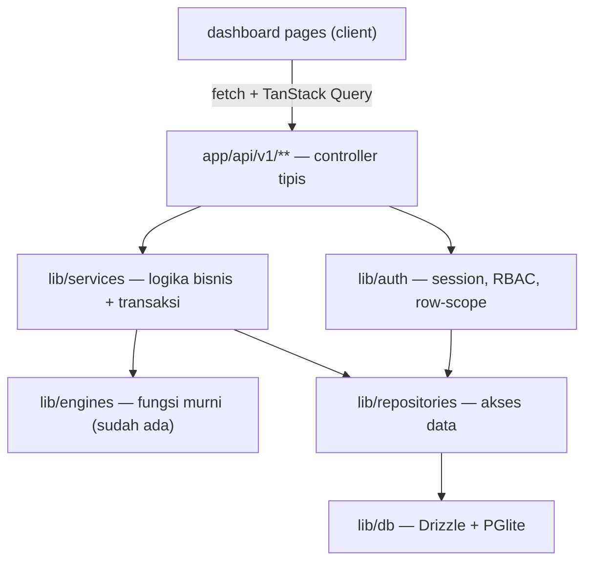
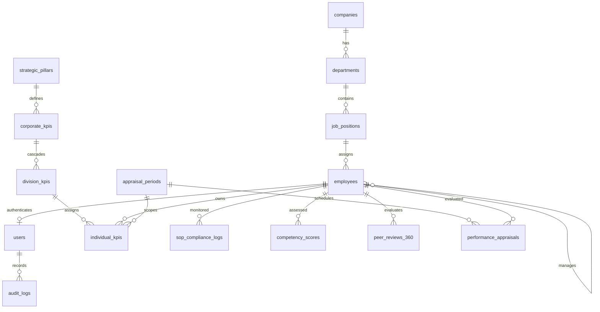
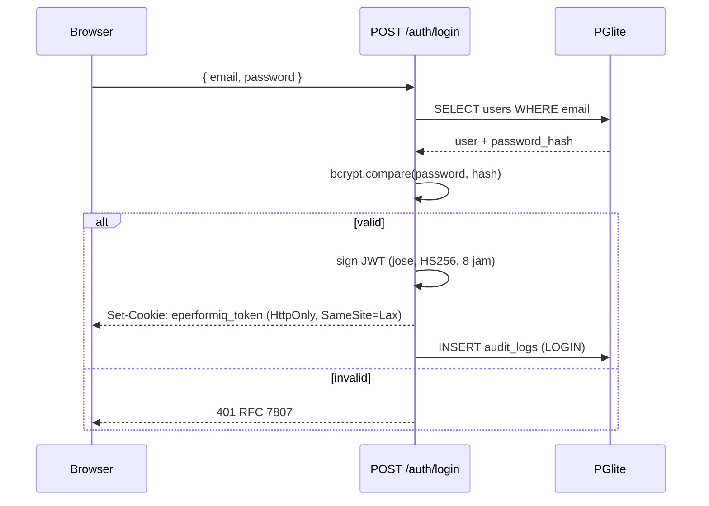
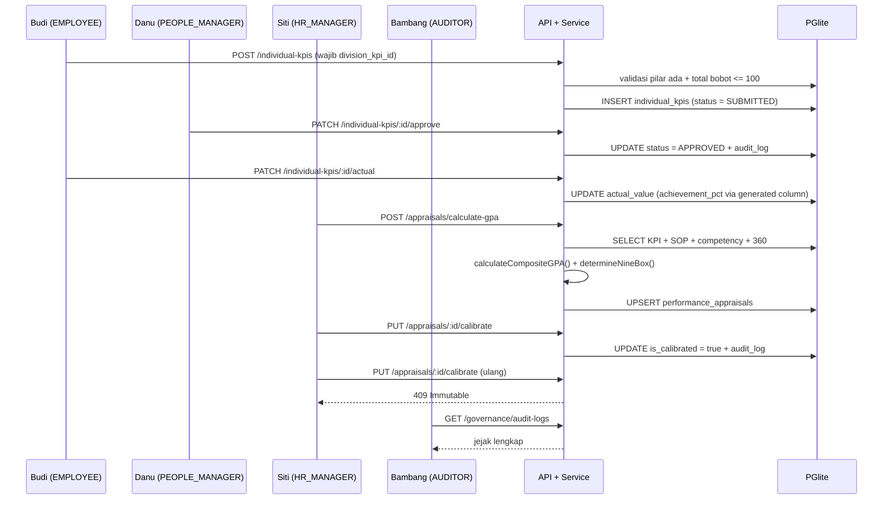

# E-PerformIQ — Desain Integrasi Database & Alur Bisnis

**Tanggal:** 2026-09-21
**Status:** Menunggu review
**PRD rujukan:** `PRD_Sistem_Penilaian_Karyawan (PT).md` v1.0.0
**Klasifikasi:** Architectural (brainstorming path)

---

## 1. Tujuan

Menjadikan aplikasi E-PerformIQ yang saat ini berstatus **prototype UI-only** menjadi sistem dengan persistensi data nyata, autentikasi asli, dan otorisasi per-role — dimulai dari satu vertical slice yang benar-benar berjalan end-to-end.

**Di luar cakupan iterasi ini:** 12 dari 18 endpoint tetap memakai data statis; modul Pre-Employment dan Post-Employment belum tersambung ke database; belum ada E2E test; PGlite bukan solusi produksi konkuren.

---

## 2. Penilaian Kondisi Saat Ini

Hasil eksplorasi kode pada 2026-09-21:

| Aspek | Kondisi |
|---|---|
| API route | 18 buah, **semuanya** mengembalikan data hardcoded dari `src/lib/dummy-data/index.ts` |
| Persistensi | Tidak ada. Tidak ada `.env`, `prisma/`, migrasi SQL, atau klien database |
| Engine | 3 buah. Hanya `gpa-engine` yang dipanggil. `vmai-engine` menyisipkan angka hardcoded di dalam fungsinya |
| State UI | `AppContext` (276 baris) memutasi state in-memory — hilang saat refresh |
| Auth | `loginWithCredentials` menerima password apa pun; token base64 palsu; role disimpan di `localStorage` |
| Otorisasi | Tidak ada. `GET /individual-kpis` menerima `employee_id` apa pun tanpa cek kepemilikan |
| Infrastruktur lokal | Node v24.14.0, npm 11.9.0. Tidak ada PostgreSQL, `psql`, atau Docker |
| Git | Bukan git repository |

**Kesimpulan:** "membuat fitur berfungsi" berarti membangun lapisan persistensi, auth, dan RBAC dari nol — bukan memperbaiki bug.

---

## 3. Keputusan yang Disetujui

| Topik | Keputusan | Alasan |
|---|---|---|
| Database | **PGlite** (PostgreSQL 16 via WASM, embedded) | PostgreSQL asli, tanpa install server. Fitur yang dipakai PRD (enum, JSONB, generated column) didukung |
| Lapisan data | **Drizzle ORM** | Driver PGlite resmi, type-safe, `drizzle-kit` untuk migrasi |
| Cakupan | **Vertical slice: During-Employment** | Mencakup 3 dari 4 acceptance criteria PRD §8; data dummy paling lengkap |
| Auth | **JWT asli + bcrypt + RBAC ditegakkan** | Menutup celah `localStorage` dan password longgar |
| Seed | **Pakai ulang `src/lib/dummy-data/index.ts`** | UI langsung terisi; tidak ada layar kosong |

---

## 4. Arsitektur

Lima lapisan dengan aturan dependensi satu arah:



**Aturan yang ditegakkan:**
1. Engine tetap fungsi murni tanpa I/O — dapat diuji tanpa database.
2. Controller tidak berisi logika bisnis — hanya parse → validasi → panggil service → bungkus response.
3. Semua penulisan yang menyentuh uang atau mengubah status dibungkus `db.transaction()`.
4. Repository satu-satunya tempat yang menyentuh Drizzle; service tidak mengimpor `drizzle-orm` secara langsung.

### 4.1 Struktur File Baru

```
src/lib/db/client.ts              — singleton PGlite + Drizzle, sadar runtime
src/lib/db/schema/*.ts            — definisi tabel Drizzle, per domain
src/lib/db/migrations/*.sql       — DDL + trigger + seed
src/lib/db/seed/index.ts          — seed dari dummy-data
src/lib/repositories/*.ts         — 1 file per agregat
src/lib/services/*.ts             — logika bisnis
src/lib/auth/session.ts           — sign/verify JWT (jose)
src/lib/auth/password.ts          — bcryptjs wrapper
src/lib/auth/rbac.ts              — matriks role → permission (deklaratif)
src/lib/auth/scope.ts             — filter baris per-role (row-level)
src/lib/api/response.ts           — envelope sukses + RFC 7807
src/lib/api/validate.ts           — helper validasi zod
src/middleware.ts                 — proteksi route kasar
```

### 4.2 Tiga Batasan Teknis PGlite

1. **Persistensi eksplisit.** PGlite default in-memory. `dataDir` diset ke `.pglite/` di root project (masuk `.gitignore`) agar data bertahan antar restart.
2. **Wajib Node runtime.** Semua route yang menyentuh DB memakai `export const runtime = 'nodejs'` dan `export const dynamic = 'force-dynamic'`. Tanpa ini Next.js mencoba membundel WASM ke Edge runtime dan gagal.
3. **Singleton wajib.** Next.js dev me-reload modul; tiap reload membuat instance PGlite baru sehingga koneksi menumpuk. Instance disimpan di `globalThis`.

**Batasan yang dinyatakan jujur:** PGlite adalah *single-connection*. Query diserialisasi internal — aman untuk dev/demo, **bukan** untuk beban konkuren produksi. Karena itu `src/lib/db/client.ts` dirancang sebagai satu-satunya titik tukar driver: pindah ke `pg` (PostgreSQL server) tidak mengubah file lain.

---

## 5. Model Data

### 5.1 Cacat pada DDL PRD §10

DDL di PRD tidak dapat dijalankan apa adanya. Perbandingan ERD §10.1 dengan DDL §10.2:

| # | Masalah | Bukti | Resolusi |
|---|---|---|---|
| 1 | Tabel yatim | `strategic_pillars.company_id`, `employees.department_id`, `employees.position_id`, `manpower_plans.department_id/position_id` semuanya `UUID NOT NULL` tanpa FK. Tabel `companies`, `departments`, `job_positions` tidak pernah didefinisikan | Tambah 3 tabel tersebut dengan DDL lengkap |
| 2 | ERD ≠ DDL | ERD §10.1 menyebut `DIVISION_KPIS` dan `COMPETENCY_SCORES`; DDL §10.2 tidak punya keduanya | Tambah `division_kpis` + `competency_scores` |
| 3 | Cascade melompati level | ERD: `DIVISION_KPIS → INDIVIDUAL_KPIS`. DDL: `individual_kpis.corporate_kpi_id → corporate_kpis` | Ikuti ERD: `division_kpi_id` jadi jalur utama; `corporate_kpi_id` tetap ada sebagai jalur langsung opsional (nullable) |
| 4 | FK menggantung | `recruitment_assessments.hiring_requisition_id UUID NOT NULL` tanpa FK; `applied_position_id` juga | Tambah `hiring_requisitions` |
| 5 | `users.employee_id` UNIQUE tapi nullable | `SUPER_ADMIN` tidak punya baris employee; PostgreSQL mengizinkan banyak `NULL` di kolom UNIQUE | Dipertahankan (memang benar), tetapi RBAC tidak boleh mengasumsikan `employee_id` selalu ada |
| 6 | `audit_logs` tidak immutable | PRD §6.2 menuntut anti-tamper, tapi tabelnya tabel biasa — siapa pun dengan hak `UPDATE` bisa mengubahnya | Trigger `BEFORE UPDATE OR DELETE` yang melempar exception + `REVOKE UPDATE, DELETE` |
| 7 | `performance_appraisals` tanpa UNIQUE | Tidak ada `UNIQUE(period_id, employee_id)`; satu karyawan bisa punya dua appraisal di periode sama | Tambah constraint |
| 8 | `individual_kpis` tanpa `status` | `types/index.ts` mendefinisikan `status: 'DRAFT' \| 'SUBMITTED' \| 'APPROVED' \| 'REJECTED'`, tapi tabel di PRD tidak punya kolom itu sama sekali. Alur persetujuan KPI mustahil tanpanya | Tambah kolom `status` dengan enum baru `kpi_status_enum` |
| 9 | Tidak ada validasi total bobot | PRD §8 menuntut KPI tertaut pilar, tapi tidak ada aturan total bobot = 100% | Validasi di service layer, bukan constraint DB (bobot diisi bertahap) |
| 10 | Tidak ada jalur *unlock* setelah kalibrasi | Trigger immutability akan mengunci permanen, termasuk untuk koreksi yang sah | Sediakan fungsi `unlock_appraisal(uuid, text)` yang hanya boleh dipanggil `SUPER_ADMIN`, dan mencatat alasan ke `audit_logs` |

### 5.2 Cakupan Tabel

Total **24 tabel**, terdiri dari:

| Asal | Jumlah | Rincian |
|---|---|---|
| DDL PRD §10.2 | 18 | Sesuai apa adanya, dengan perbaikan pada 10 cacat di §5.1 |
| Tabel hilang yang direferensikan FK | 3 | `companies`, `departments`, `job_positions` |
| Tabel di ERD §10.1 tapi tidak ada di DDL | 2 | `division_kpis`, `competency_scores` |
| Tabel hilang yang direferensikan FK | 1 | `hiring_requisitions` |

**15 tabel di-seed dan dipakai** oleh vertical slice During-Employment:

`companies`, `departments`, `job_positions`, `employees`, `users`, `strategic_pillars`, `corporate_kpis`, `division_kpis`, `appraisal_periods`, `individual_kpis`, `sop_compliance_logs`, `competency_scores`, `peer_reviews_360`, `performance_appraisals`, `audit_logs`

**9 tabel dibuat sekarang tetapi kosong:**

`manpower_plans`, `hiring_requisitions`, `recruitment_assessments`, `onboarding_milestones`, `offboarding_requests`, `knowledge_handovers`, `severance_calculations`, `lifetime_contributions`, `vmai_scorecards`

Alasan membuat semuanya sekaligus: menghindari migrasi ulang schema saat fase Pre-Employment dan Post-Employment dikerjakan.

**7 enum** yang dibutuhkan: `bsc_perspective_enum`, `employee_status_enum`, `user_role_enum`, `period_status_enum`, `nine_box_quadrant_enum`, `offboarding_status_enum`, dan `kpi_status_enum` (baru, lihat §5.1 butir 8).



### 5.3 Pemetaan Tipe TypeScript ↔ Kolom DB

`src/types/index.ts` dan DDL PRD tidak sepenuhnya cocok. Contoh konkret:

| Tipe TS | Field | Kondisi di DDL | Resolusi |
|---|---|---|---|
| `IndividualKPI` | `strategicPillarName` | Tidak ada kolom | Tidak disimpan; di-join saat query |
| `IndividualKPI` | `status` | Tidak ada kolom | Tambah `kpi_status_enum` |
| `IndividualKPI` | `periodId: string` | `period_id UUID` | TS diubah jadi `periodId: string` yang berisi UUID periode |
| `Employee` | `department: string` | `department_id UUID` | TS diubah jadi `departmentId: string`; nama departemen di-join |
| `Employee` | `gpa`, `rating`, `nineBoxQuadrant` | Tidak ada di `employees` | Turunan dari `performance_appraisals`; tidak disimpan di master |
| `VMAIScorecard` | seluruhnya | `vmai_scorecards` ada tapi di luar slice | Di luar cakupan iterasi ini |

**Aturan:** DDL PRD adalah sumber kebenaran untuk kolom. `types/index.ts` disesuaikan mengikuti, bukan sebaliknya.

---

## 6. Autentikasi & Otorisasi

### 6.1 Alur Login



**Perubahan dari kondisi sekarang:**
- Token di cookie **HttpOnly**, bukan `localStorage` — menutup celah XSS.
- `bcryptjs` dengan cost 10; tidak ada password yang lolos tanpa hash cocok.
- `AuthContext` tidak lagi menyimpan role. Ia memanggil `GET /api/v1/auth/me` untuk membaca sesi, dengan state `isLoading` agar tidak flicker ke halaman login.

### 6.2 Matriks RBAC Deklaratif

Satu matriks di `src/lib/auth/rbac.ts` — bukan `if` tersebar di 18 route:

| Endpoint | SUPER_ADMIN | BOD | HR_MANAGER | PEOPLE_MANAGER | EMPLOYEE | AUDITOR |
|---|:-:|:-:|:-:|:-:|:-:|:-:|
| `GET /performance/individual-kpis` | ✓ | ✓ | ✓ | ✓ | own only | ✓ |
| `POST /performance/individual-kpis` | ✓ | – | ✓ | ✓ | own only | – |
| `PATCH /performance/individual-kpis/:id` | ✓ | – | ✓ | reports only | own only | – |
| `PATCH /performance/individual-kpis/:id/approve` | ✓ | – | ✓ | reports only | – | – |
| `POST /performance/appraisals/calculate-gpa` | ✓ | – | ✓ | reports only | – | – |
| `PUT /performance/appraisals/:id/calibrate` | ✓ | ✓ | ✓ | – | – | – |
| `GET /governance/audit-logs` | ✓ | – | – | – | – | ✓ |
| `POST /auth/login` | publik | publik | publik | publik | publik | publik |
| `GET /auth/me` | ✓ | ✓ | ✓ | ✓ | ✓ | ✓ |

### 6.3 Dua Tingkat Otorisasi

**Tingkat role** — apakah role ini boleh memanggil endpoint sama sekali.

**Tingkat baris** (`src/lib/auth/scope.ts`) — filter data yang dikembalikan:
- `EMPLOYEE`: hanya baris dengan `employee_id = dirinya`.
- `PEOPLE_MANAGER`: bawahan langsung **dan tidak langsung**, ditelusuri rekursif lewat `employees.manager_id` (recursive CTE, kedalaman maksimum 5 untuk mencegah siklus).
- `HR_MANAGER`, `BOD`, `AUDITOR`, `SUPER_ADMIN`: seluruh organisasi.

Tanpa tingkat kedua, karyawan dapat membaca KPI orang lain hanya dengan menebak `employee_id` di query string. Lubang ini ada di route `GET /individual-kpis` saat ini.

### 6.4 Immutability Nilai Final

PRD §6.2 menuntut nilai yang sudah dikalibrasi tidak dapat diubah. Ditegakkan di **tiga lapis**:

1. **Service layer** — `calibrateAppraisal()` melempar `ImmutableRecordError` (`409`) jika `is_calibrated = true`.
2. **Database trigger** — `BEFORE UPDATE ON performance_appraisals` melempar exception jika `OLD.is_calibrated = true`, kecuali pemanggilan berasal dari fungsi `unlock_appraisal()`.
3. **Audit log** — setiap kalibrasi menulis `old_data` + `new_data` sebagai JSONB beserta `user_id` pelaku.

Lapis 2 yang krusial: tanpa itu, satu bug di service layer dapat merusak data permanen.

---

## 7. Alur Vertical Slice



### 7.1 Acceptance Criteria PRD §8 yang Dibuktikan

| Kriteria | Cara dibuktikan | Kondisi sekarang |
|---|---|---|
| Cascading KPI: sistem menolak KPI individu tanpa tautan strategis | `POST /individual-kpis` tanpa `division_kpi_id` → `422` | Mengembalikan `201` palsu |
| Perhitungan GPA ≤ 1000 ms per 10.000 karyawan | Ukur durasi batch dan log; uji dengan seed 10.000 baris pada benchmark terpisah | Tidak terukur; hasil hardcoded |
| Clearance Resign: pesangon tidak dapat dicetak jika checklist belum selesai | Di luar slice ini (Post-Employment). Gate-nya dirancang sekarang di service `assertClearanceComplete()` | Tidak ada |
| Laporan VMAI: kesesuaian formula 100% | Di luar slice ini. `vmai-engine` dibersihkan dari angka hardcoded agar dapat dipakai nanti | Angka hardcoded di dalam fungsi |

### 7.2 Pekerjaan Tambahan yang Teridentifikasi

- `vmai-engine.ts` menyisipkan objek `perspectives` dengan angka literal (`92.4`, `87.1`, `94.8`, `83.3`) dan kemudian menimpanya sebagian dari `pillars`. Bila `pillars` kosong, angka palsu itu yang keluar. Perlu dihapus dan diganti perhitungan penuh.
- `severance-engine.ts` hanya menerima `serviceYears` bertipe `number`. Perhitungan masa kerja dari tanggal harus dilakukan pemanggil, dan belum ada di mana pun. Perlu helper `calculateServiceYears(joinDate, lastWorkingDay)`.
- `individual-kpis/route.ts` mengimpor `@/lib/dummy-data` secara dinamis di dalam handler GET (baris 144) — pola yang menyulitkan pengujian.

---

## 8. Perubahan UI

Seminimal mungkin agar risiko terkendali:

| File | Perubahan |
|---|---|
| `src/lib/context/AuthContext.tsx` | Buang `localStorage`; baca sesi dari `GET /auth/me`. Tambah `isLoading`. |
| `src/lib/context/AppContext.tsx` | **Dihapus.** 276 baris state in-memory diganti TanStack Query hooks (`useKPIs`, `useAppraisal`). |
| `src/app/login/page.tsx` | Pertahankan 6 tombol role. Password demo diganti hash bcrypt asli di seed. Pesan error dari respons `401`. |
| `src/app/dashboard/manager-cockpit/page.tsx` | Tombol "Approve KPI" memanggil `PATCH` asli, bukan mutasi state. |
| `src/app/dashboard/employee-portal/page.tsx` | Input realisasi KPI memanggil `PATCH` asli. |
| `src/components/navigation/Sidebar.tsx` | Saring menu per-role. Saat ini `EMPLOYEE` dapat mengklik "Executive Boardroom". |
| `src/middleware.ts` | Baru. Redirect belum-login → `/login`. |

**Catatan:** menyembunyikan menu **bukan** keamanan, hanya UX. Otorisasi sebenarnya ada di API. Sidebar disaring supaya karyawan tidak melihat menu yang akan gagal.

---

## 9. Strategi Pengujian

Mengikuti TDD (RED → GREEN → REFACTOR).

| Lapis | Cakupan | Catatan |
|---|---|---|
| Unit | `gpa-engine`, `severance-engine`, validasi bobot, `rbac.ts` | Tanpa database. Paling murah, paling bernilai — rumus inilah yang menentukan uang dan peringkat orang |
| Integrasi | Service + PGlite in-memory (`new PGlite()` tanpa `dataDir`) | Tiap tes terisolasi |
| API | Route handler dengan `Request`/`Response` langsung | Termasuk jalur `401`, `403`, `409`, `422` |

**Tidak diuji di iterasi ini:** E2E browser. Terlalu mahal untuk fondasi yang masih bergerak.

Tools: Vitest. Belum ada di `package.json` dan akan ditambahkan.

---

## 10. Risiko

| Risiko | Dampak | Mitigasi |
|---|---|---|
| PGlite single-connection | Query konkuren diserialisasi; tidak layak produksi | Titik tukar driver tunggal di `client.ts`; dokumentasikan batas ini |
| WASM tidak jalan di Edge runtime | Route gagal saat build | `runtime = 'nodejs'` di setiap route DB; diverifikasi lewat `npm run build` |
| Menghapus `AppContext` memutus 6 halaman | Halaman blank | Dikerjakan bertahap: tambah hooks, migrasikan halaman satu per satu, hapus terakhir |
| Bukan git repo | Tidak ada titik kembali saat perubahan besar | Inisialisasi git + commit awal sebelum menyentuh kode |
| Seed ulang menimpa data | Kehilangan data uji manual | Seed idempoten lewat `ON CONFLICT DO NOTHING`; perintah `db:reset` terpisah dan eksplisit |
| Perbedaan tipe TS vs DDL meluas | Error kompilasi berantai | Petakan seluruh perbedaan di muka (lihat §5.3) sebelum menulis kode |
| `calculateServiceYears` belum ada | Pesangon bisa salah hitung di fase berikutnya | Buat helper + tes unit sekarang meski belum dipakai UI |

---

## 11. Urutan Pengerjaan

Disusun agar setiap langkah dapat diverifikasi sebelum lanjut. Rincian task akan ditulis oleh skill `writing-plans`.

1. **Fondasi** — inisialisasi git; tambah dependensi (`@electric-sql/pglite`, `drizzle-orm`, `drizzle-kit`, `jose`, `bcryptjs`, `zod`, `@tanstack/react-query`, `vitest`); buat `client.ts` singleton; verifikasi PGlite hidup lewat skrip kecil.
2. **Schema** — DDL lengkap 24 tabel + 7 enum + trigger immutability + index; migrasi dijalankan; verifikasi dengan query ke `information_schema`.
3. **Seed** — pindahkan `dummy-data` ke seed SQL idempoten; 6 user dengan hash bcrypt asli; verifikasi jumlah baris per tabel.
4. **Auth** — `password.ts`, `session.ts`, `rbac.ts`, `scope.ts`; route `login` dan `me`; tes unit + integrasi.
5. **Repository & service KPI** — `individualKpiRepository`, `kpiService` (termasuk validasi tautan pilar dan total bobot); tes.
6. **Service GPA & kalibrasi** — `appraisalService`; bersihkan `vmai-engine`; tes termasuk jalur `409`.
7. **Route** — perbarui 6 endpoint slice dengan guard + validasi zod + envelope konsisten; tes API.
8. **UI** — hooks TanStack Query; migrasikan `manager-cockpit` dan `employee-portal`; perbarui `AuthContext`; saring `Sidebar`; tambah `middleware.ts`; hapus `AppContext`.
9. **Verifikasi** — `npm run build` lulus; `tsc --noEmit` bersih; seluruh tes hijau; alur 6 role dijalankan manual di browser.

---

## 12. Yang Tidak Dikerjakan di Iterasi Ini

Dinyatakan eksplisit agar tidak ada harapan keliru:

- 12 endpoint di luar slice (Pre-Employment, Post-Employment, sebagian Analytics) tetap memakai data statis.
- `vmai_scorecards` tidak diisi; laporan VMAI belum berjalan.
- Redis, BullMQ, MinIO/S3, read replica (PRD §6.1) — tidak ada. Tidak diperlukan untuk slice ini.
- Enkripsi at-rest AES-256 (PRD §6.2) — tidak diterapkan; PGlite menyimpan file tanpa enkripsi.
- Refresh token (PRD §11.2) — hanya access token 8 jam.
- E2E test, CI/CD, Docker.
- 9-Box matrix interaktif dan kurva Gaussian tetap memakai data statis.