# Spesifikasi Arsitektur Sistem 6 Kotak (Govera360) Terintegrasi E-PerformIQ

**Tanggal:** 2026-09-25  
**Status:** Menunggu Review & Persetujuan (Architectural Path)  
**PRD Rujukan:** `PRD_Sistem_Penilaian_Karyawan (PT).md` v1.0.0 & Blueprint Govera360  
**Klasifikasi:** Enterprise Architecture Specification  

---

## 1. Tujuan & Latar Belakang

Integrasi ini bertujuan mengevolusikan sistem **E-PerformIQ** (yang saat ini mengelola evaluasi kinerja 3 fase: *Pre*, *During*, *Post-Employment*) menjadi platform tata kelola tenaga kerja terpadu **Govera360 / 6-Box Architecture**, dengan tetap mempertahankan keabsahan seluruh acuan resmi yang telah ditetapkan:

1. **Peraturan Pemerintah (PP) No. 35 Tahun 2021:** Batasan waktu kerja & lembur (Pasal 26-29), ketentuan PKWT tertulis, dan kompensasi pesangon statuter (UP, UPMK, UPH).
2. **Peraturan Pemerintah (PP) No. 36 Tahun 2021 jo PP No. 51/2023:** Penerapan struktur dan skala upah yang adil, proporsional, dan transparan.
3. **Standar Internasional ISO 30414:2019 (Human Capital Reporting):** Kepatuhan pelaporan modal manusia pada metrik *Quality of Hire (QoH)*, *Total Cost of Workforce (TCOW)*, *Productivity*, dan *Training Effectiveness*.
4. **Balanced Scorecard (BSC) Kaplan & Norton:** Keselarasan cascading 4 pilar kinerja korporat (Finansial, Pelanggan, Proses Internal, Pembelajaran & Pertumbuhan) menuju *Vision & Mission Alignment Index (VMAI)*.
5. **9-Box Talent Matrix (GE/McKinsey) & Kurva Gaussian BUMN:** Segmentasi talenta objektif untuk perencanaan suksesi kepemimpinan dan penjagaan distribusi nilai yang sehat.
6. **Good Corporate Governance (KNKG TARIF):** Penegakan prinsip *Transparency, Accountability, Responsibility, Independency, Fairness* dengan audit trail permanen (*immutable*).

---

## 2. Paradigma Antarmuka: Dual Dashboard

Sistem mengadopsi pemisahan pengalaman pengguna (*User Experience*) menjadi dua antarmuka terarah:

```
┌─────────────────────────────────────────────────────────────────────────────┐
│                            DUAL DASHBOARD SYSTEM                            │
├──────────────────────────────────────┬──────────────────────────────────────┤
│  DASHBOARD PEKERJA (SELF-SERVICE)    │  DASHBOARD PENGUSAHA/ADMIN (COMMAND) │
│  • Format: Responsive Mobile & Web   │  • Format: Desktop Wide Screen       │
│  • Paradigma: Karyawan Subjek Aktif  │  • Paradigma: Helicopter Strategic   │
│  • Modul Terkait:                    │  • Modul Terkait:                    │
│    - Kotak 1: Timesheet & Bukti KPI  │    - Kotak 1: Kalibrasi Kurva & 9-Box│
│    - Kotak 2: Peta Karir & Moodle    │    - Kotak 2: Talent Pipeline Matrix │
│    - Kotak 3: Bursa Lowongan Intern  │    - Kotak 3: Realisasi MPP & Seleksi│
│    - Kotak 4: Pengajuan Cuti & Izin  │    - Kotak 4: Flight Risk & Audit SPI│
│    - Kotak 5: Slip Gaji & Klaim      │    - Kotak 5: Cost of Workforce & P&L│
│    - Kotak 6: FAQ & Tiket Bantuan    │    - Kotak 6: Pengawasan Tiket & WBS │
└──────────────────────────────────────┴──────────────────────────────────────┘
```

---

## 3. Spesifikasi Arsitektur 6 Kotak Utama

```mermaid
graph TD
    subgraph K1["KOTAK 1: Performance Hub"]
        K1_A["Timesheet & Log Harian"] --> K1_B["Evaluasi KPI 4 Pilar BSC"]
        K1_B --> K1_C["Composite GPA (Skala 4.00)"]
        K1_C --> K1_D["Sinyal Rekomendasi AI (Promosi/Mutasi/PIP)"]
    end

    subgraph K2["KOTAK 2: Learning & Career Path"]
        K2_A["Peta Karir / Job Grade Ladder"] --> K2_B["Moodle SSO (LTI / OAuth2)"]
        K2_B --> K2_C["AI Skill Gap Course Recommender"]
    end

    subgraph K3["KOTAK 3: Talent Acquisition"]
        K3_A["Manpower Planning (MPP)"] --> K3_B["Internal Mobility / Job Board"]
        K3_B --> K3_C["Screening CV AI & Quality of Hire (QoH)"]
    end

    subgraph K4["KOTAK 4: Core HR & GCG"]
        K4_A["Data Karyawan & Kontrak E-Sign"] --> K4_B["Pengajuan Cuti / Izin / Absen"]
        K4_B --> K4_C["AI Flight Risk & Early Warning Retention"]
    end

    subgraph K5["KOTAK 5: Payroll & Finance"]
        K5_A["Struktur & Skala Upah (PP 36/2021)"] --> K5_B["Slip Gaji Digital PIN & Reimbursement"]
        K5_B --> K5_C["AI Cost of Workforce vs Output Ratio"]
    end

    subgraph K6["KOTAK 6: Employee Voice & Helpdesk"]
        K6_A["Sistem Tiket & Whistleblowing (WBS)"] --> K6_B["Pusat Panduan & Knowledge Base"]
        K6_C["Chatbot AI 24/7 Aturan PP & SOP"] --> K6_A
    end

    K1_D -.-> K2_C
    K1_C -.-> K5_C
    K4_C -.-> K1_A
    K6_C -.-> K4_A
```



---

### KOTAK 1: Pusat Produktivitas & Penilaian Kinerja (Performance Hub)

* **Fungsi Inti:** Pelacakan produktivitas harian dan capaian KPI SMART terbobot, terhubung dengan kepatuhan SOP (20%), kompetensi (15%), dan budaya AKHLAK 360° (15%).
* **Fitur Self-Service (Pekerja):**
  - Pengisian lembar kerja harian (*timesheet*) dengan validasi batas jam kerja sah PP 35/2021 (maks. 40 jam/minggu reguler).
  - *Self-assessment* mandiri sebelum atasan melakukan review berkala.
  - Pengunggahan dokumen atau tautan portofolio bukti kerja (*evidence attachment*) pada tiap kartu KPI.
* **Analisis Bantuan AI (Manajemen):**
  - Komparasi tren output kerja terhadap jam kerja riil.
  - *Sinyal Rekomendasi Cerdas:* Mengidentifikasi status karyawan secara matematis:
    - **Fast-Track Promotion:** Masuk kuadran 9 (Future Leader) + GPA $\ge 3.70$.
    - **Role Re-alignment / Mutasi:** Masuk kuadran 7 (Enigma) dengan potensi tinggi namun capaian terhambat beban kerja departemen.
    - **Mandat PIP (60 Hari):** GPA $< 2.00$ atau masuk kuadran 1 (Underperformer).

---

### KOTAK 2: Akademi & Peta Jenjang Karir (Learning & Career Path)

* **Fungsi Inti:** Integrasi mulus ke Learning Management System (LMS Moodle) tanpa login ulang (*SSO LTI 1.3 / OAuth2*), serta visualisasi matriks jenjang karir.
* **Fitur Self-Service (Pekerja):**
  - Tampilan visual "Tangga Karir" (*Job Grade Ladder*) yang merinci prasyarat keahlian dari tingkat Staf, Senior, Supervisor, hingga Manager.
  - Pendaftaran mandiri (*self-enrollment*) pada silabus modul pelatihan Moodle yang menjadi syarat promosi jabatan.
* **Analisis Bantuan AI (Manajemen):**
  - *Skill-Gap Auto-Bridging:* Mengambil data kesenjangan kompetensi dari `competency_scores` Kotak 1. Jika terdapat gap negatif pada keterampilan teknis tertentu, AI langsung menyematkan modul kursus Moodle yang relevan di portal karyawan.
  - Pelacakan pemenuhan standar ISO 30414 Clause 4.9 (target rata-rata minimal 24 jam pelatihan/tahun).

---

### KOTAK 3: Rekrutmen, Seleksi & Perencanaan Tenaga Kerja (Talent Acquisition)

* **Fungsi Inti:** Perencanaan formasi tahunan (*Manpower Planning* / MPP), portal bursa lowongan (internal & eksternal), dan orientasi pegawai baru (*onboarding* 30-60-90 hari).
* **Fitur Self-Service (Pekerja & Pelamar):**
  - **Internal Mobility Board:** Pekerja aktif dapat melamar posisi baru atau mengajukan rotasi langsung dari portal pribadi.
  - **Self-Scheduled Interview:** Pelamar dapat memilih jadwal slot wawancara yang tersedia di kalender rekruiter secara mandiri.
* **Analisis Bantuan AI (Manajemen):**
  - *Workload-based Workforce Planning:* Menganalisis beban kerja departemen saat ini untuk memproyeksikan kebutuhan formasi tahun depan secara terukur.
  - *Smart Screening & QoH:* Penilaian otomatis kecocokan CV pelamar dengan spesifikasi jabatan (`job_positions.competency_dictionary`), dilanjutkan dengan penghitungan indeks *Quality of Hire (QoH)* sesuai ISO 30414.

---

### KOTAK 4: Sentral HR & Hubungan Industrial (Core HR & GCG)

* **Fungsi Inti:** Pangkalan data karyawan, pengelolaan dokumen Peraturan Perusahaan (PP) & SOP resmi, administrasi kontrak kerja tertulis (PKWT/PKWTT), dan pengajuan izin/cuti.
* **Fitur Self-Service (Pekerja):**
  - Pembaruan mandiri data personal (alamat domisili, nomor kontak darurat, rekening bank gaji, status tanggungan pajak PTKP).
  - Formulir digital pengajuan cuti tahunan, izin sakit, dan koreksi absensi dengan alur persetujuan (*approval hierarchy*) berjenjang ke atasan langsung.
* **Analisis Bantuan AI (Manajemen):**
  - *AI Flight Risk Detector:* Menganalisis pola anomali absensi (Bradford Factor $> 45$), penurunan skor interaksi 360°, dan tren produktivitas untuk mendeteksi potensi pengunduran diri talenta kunci lebih awal (*early retention alert*).
  - *Contract Expiry Sentinel:* Peringatan otomatis 60 dan 30 hari sebelum masa berlaku PKWT berakhir guna kepatuhan regulasi ketenagakerjaan RI.

---

### KOTAK 5: Pengupahan, Finansial & Akuntansi Dasar (Payroll & Finance)

* **Fungsi Inti:** Penerapan Struktur dan Skala Upah (PP 36/2021 jo PP 51/2023), kalkulator pesangon statuter PP 35/2021, penerbitan slip gaji digital, dan klaim pengeluaran operasional.
* **Fitur Self-Service (Pekerja):**
  - Akses dan unduh Slip Gaji Digital terenkripsi yang dilindungi PIN otentikasi.
  - Pengajuan *reimbursement* (klaim biaya kesehatan/dinas) mandiri dengan pengunggahan foto struk bukti transaksi.
* **Analisis Bantuan AI (Manajemen):**
  - *Total Cost of Workforce (TCOW) Analytics:* Mengintegrasikan pengeluaran finansial (gaji pokok, tunjangan, klaim, lembur) dengan output realisasi KPI Kotak 1.
  - Menyajikan rasio efisiensi biaya tenaga kerja terhadap pendapatan perusahaan (*Workforce ROI*) sesuai klausul ISO 30414 Clause 4.6.

---

### KOTAK 6: Saluran Komunikasi & Bantuan (Employee Voice & Helpdesk)

* **Fungsi Inti:** Sistem penanganan keluhan (*Ticketing System*), saluran pelaporan pelanggaran etika dan kepatuhan (*Whistleblowing System* / WBS), pusat panduan mandiri, dan asisten virtual cerdas.
* **Fitur Self-Service (Pekerja):**
  - Pencarian solusi mandiri melalui *Knowledge Base & User Guide Fullscreen* yang telah terpasang.
  - Pembuatan tiket pertanyaan HR atau keluhan fasilitas kantor dengan nomor pelacakan transparan (*SLA tracking*).
  - Pengiriman laporan dugaan kecurangan atau pelanggaran etika melalui form *Whistleblowing* dengan enkripsi penuh dan opsi anonimitas terjamin (GCG Fairness).
* **Analisis Bantuan AI (Manajemen):**
  - *Chatbot Kebijakan HR 24/7:* Asisten yang dilatih untuk memahami dokumen Peraturan Perusahaan, SOP operasional, dan hak-hak ketenagakerjaan resmi. Asisten dapat langsung menjawab pertanyaan rutin karyawan (seperti jatah cuti, tata cara klaim kacamata, atau dasar hitungan pesangon).
  - Analisis tren keluhan tiket untuk mengidentifikasi divisi yang membutuhkan perhatian khusus dari manajemen.

---

## 4. Ekstensi Skema Basis Data

Ekstensi ini dirancang **tanpa mengubah skema 24 tabel utama yang sudah ada**, melainkan menambahkan tabel pelengkap yang terhubung melalui *Foreign Key*:

```sql
-- KOTAK 1: TIMESHEET & BUKTI KERJA
CREATE TABLE daily_timesheets (
  id UUID PRIMARY KEY DEFAULT gen_random_uuid(),
  employee_id UUID NOT NULL REFERENCES employees(id) ON DELETE CASCADE,
  work_date DATE NOT NULL,
  regular_hours DECIMAL(4,2) NOT NULL DEFAULT 8.00,
  overtime_hours DECIMAL(4,2) NOT NULL DEFAULT 0.00 CHECK (overtime_hours <= 4.00),
  task_summary TEXT NOT NULL,
  approval_status VARCHAR(20) NOT NULL DEFAULT 'APPROVED'
    CHECK (approval_status IN ('SUBMITTED','APPROVED','REJECTED')),
  created_at TIMESTAMPTZ DEFAULT CURRENT_TIMESTAMP,
  UNIQUE (employee_id, work_date)
);

CREATE TABLE kpi_evidence_attachments (
  id UUID PRIMARY KEY DEFAULT gen_random_uuid(),
  individual_kpi_id UUID NOT NULL REFERENCES individual_kpis(id) ON DELETE CASCADE,
  file_title VARCHAR(255) NOT NULL,
  file_url TEXT NOT NULL,
  uploaded_at TIMESTAMPTZ DEFAULT CURRENT_TIMESTAMP
);

-- KOTAK 2: AKADEMI & LMS MOODLE
CREATE TABLE career_path_levels (
  id UUID PRIMARY KEY DEFAULT gen_random_uuid(),
  job_position_id UUID NOT NULL REFERENCES job_positions(id) ON DELETE CASCADE,
  target_position_id UUID NOT NULL REFERENCES job_positions(id) ON DELETE CASCADE,
  min_gpa DECIMAL(4,2) NOT NULL DEFAULT 3.00,
  min_service_months INT NOT NULL DEFAULT 12,
  required_skills JSONB NOT NULL,
  created_at TIMESTAMPTZ DEFAULT CURRENT_TIMESTAMP
);

CREATE TABLE moodle_course_enrollments (
  id UUID PRIMARY KEY DEFAULT gen_random_uuid(),
  employee_id UUID NOT NULL REFERENCES employees(id) ON DELETE CASCADE,
  moodle_course_id INT NOT NULL,
  course_title VARCHAR(255) NOT NULL,
  completion_pct DECIMAL(5,2) NOT NULL DEFAULT 0.00,
  score DECIMAL(5,2),
  is_certified BOOLEAN NOT NULL DEFAULT FALSE,
  enrolled_at TIMESTAMPTZ DEFAULT CURRENT_TIMESTAMP,
  completed_at TIMESTAMPTZ
);

-- KOTAK 4: CUTI, IZIN & KONTRAK E-SIGN
CREATE TABLE leave_requests (
  id UUID PRIMARY KEY DEFAULT gen_random_uuid(),
  employee_id UUID NOT NULL REFERENCES employees(id) ON DELETE CASCADE,
  leave_type VARCHAR(30) NOT NULL CHECK (leave_type IN ('ANNUAL','SICK','MATERNITY','SPECIAL')),
  start_date DATE NOT NULL,
  end_date DATE NOT NULL,
  total_days INT NOT NULL CHECK (total_days > 0),
  reason TEXT NOT NULL,
  status VARCHAR(20) NOT NULL DEFAULT 'SUBMITTED'
    CHECK (status IN ('SUBMITTED','APPROVED','REJECTED','CANCELLED')),
  approver_id UUID REFERENCES employees(id) ON DELETE SET NULL,
  approved_at TIMESTAMPTZ,
  created_at TIMESTAMPTZ DEFAULT CURRENT_TIMESTAMP
);

-- KOTAK 5: REIMBURSEMENT & KEUANGAN SDM
CREATE TABLE expense_claims (
  id UUID PRIMARY KEY DEFAULT gen_random_uuid(),
  employee_id UUID NOT NULL REFERENCES employees(id) ON DELETE CASCADE,
  claim_category VARCHAR(30) NOT NULL CHECK (claim_category IN ('MEDICAL','TRAVEL','OPERATIONAL')),
  amount DECIMAL(15,2) NOT NULL CHECK (amount > 0),
  receipt_url TEXT NOT NULL,
  claim_date DATE NOT NULL,
  status VARCHAR(20) NOT NULL DEFAULT 'SUBMITTED'
    CHECK (status IN ('SUBMITTED','APPROVED','PAID','REJECTED')),
  processed_at TIMESTAMPTZ,
  created_at TIMESTAMPTZ DEFAULT CURRENT_TIMESTAMP
);

-- KOTAK 6: HELPDESK & WHISTLEBLOWING (WBS)
CREATE TABLE helpdesk_tickets (
  id UUID PRIMARY KEY DEFAULT gen_random_uuid(),
  employee_id UUID REFERENCES employees(id) ON DELETE SET NULL,
  is_whistleblowing BOOLEAN NOT NULL DEFAULT FALSE,
  ticket_category VARCHAR(50) NOT NULL,
  subject VARCHAR(255) NOT NULL,
  detail TEXT NOT NULL,
  priority VARCHAR(20) NOT NULL DEFAULT 'MEDIUM' CHECK (priority IN ('LOW','MEDIUM','HIGH','URGENT')),
  status VARCHAR(20) NOT NULL DEFAULT 'OPEN' CHECK (status IN ('OPEN','IN_PROGRESS','RESOLVED','CLOSED')),
  assigned_to UUID REFERENCES users(id) ON DELETE SET NULL,
  resolution_notes TEXT,
  created_at TIMESTAMPTZ DEFAULT CURRENT_TIMESTAMP
);
```

---

## 5. Rencana Pengujian & Kriteria Penerimaan

| Modul | Kriteria Keberhasilan | Metrik Pengujian |
| :--- | :--- | :--- |
| **Kotak 1** | Timesheet dan lampiran bukti kerja tersimpan secara reaktif dan memperbarui persentase progres KPI. | 100% data tersinkronisasi ke penghitungan GPA |
| **Kotak 2** | Peta jenjang karir menampilkan gap keahlian dan merekomendasikan silabus kursus yang sesuai. | Karyawan dapat mendaftar modul pelatihan secara mandiri |
| **Kotak 3** | Karyawan dapat melamar lowongan internal; kuota rekrutmen terhubung ke batas anggaran MPP. | Nol deviasi anggaran tanpa persetujuan Direksi |
| **Kotak 4** | Pengajuan cuti memotong saldo hak cuti secara otomatis dan lolos validasi persetujuan atasan. | Saldo cuti terhitung presisi sesuai masa kerja |
| **Kotak 5** | Pengajuan klaim dan slip gaji digital terlindungi otentikasi aman; laporan rasio TCOW tampil akurat. | Slip gaji hanya dapat diakses oleh pemilik akun |
| **Kotak 6** | Tiket bantuan dan laporan WBS tersimpan aman dengan enkripsi; pusat panduan fullscreen terhubung ke chatbot. | Identitas pelapor WBS terlindungi penuh (GCG Fairness) |

---

## 6. Tahapan Pelaksanaan (Next Steps)

1. **Tahap 1:** Tinjauan dan persetujuan spesifikasi desain ini oleh pengguna.
2. **Tahap 2:** Penyusunan rencana implementasi terinci (*Implementation Plan*) dengan pembagian tugas modular.
3. **Tahap 3:** Eksekusi implementasi secara bertahap (*Test-Driven Development*), dimulai dari antarmuka *Dashboard Pekerja (Self-Service)* dan modul Kotak 1 & Kotak 4.
